# 词源零壹 · 提示词广场 — GPT-IMAGE2 精选提示词（50 条）

> **来源**：https://www.ciyuan01.com/prompts
> **分类**：GPT-IMAGE2
> **导出时间**：2026-08-09
> **说明**：以下提示词与封面图均提取自网站原有数据（每条含 `imageUrl` / `title` / `modelName` / `promptText` 字段，未作任何改写或生成）。图片按页面顺序编号 01–50，与提示词一一对应，存放于 `ciyuan01_prompt_images/NN.webp`（部分为改造前对比图 `NN_before.webp`）。

---

## 01 · 毛坯房转现代客厅效果图

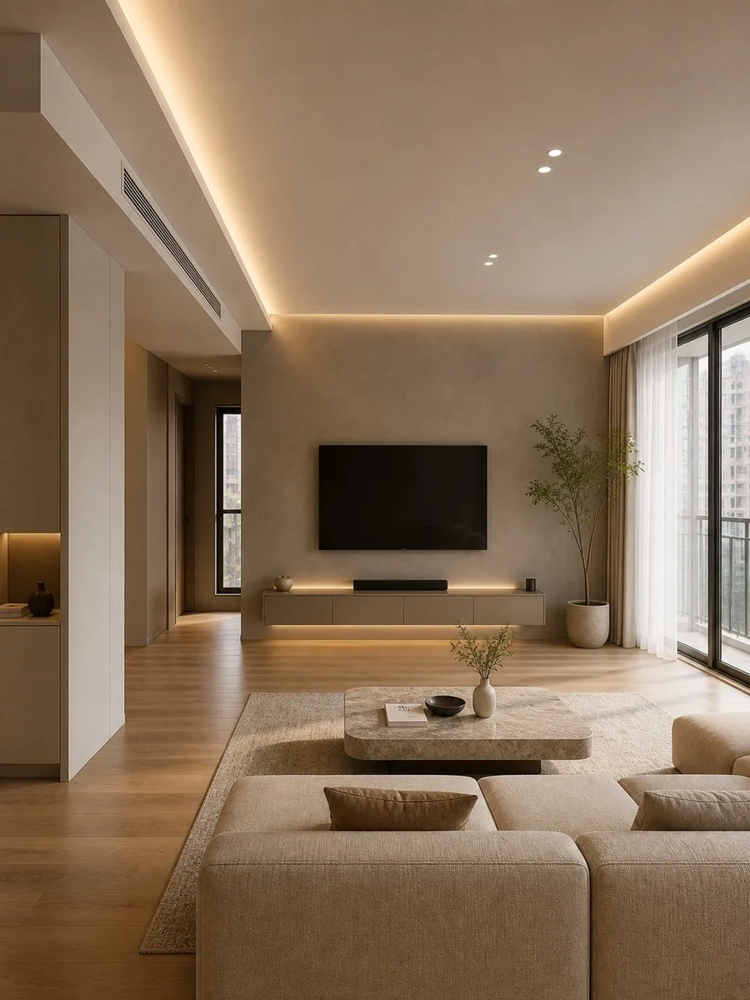

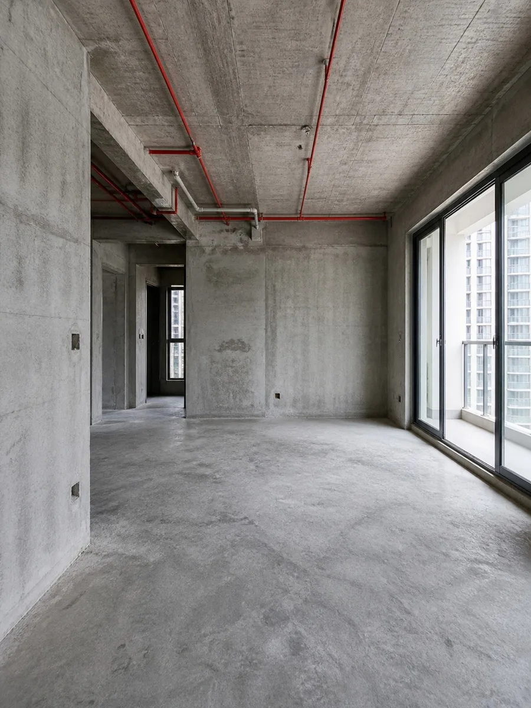

请基于上传的毛坯房照片生成一张现代温暖风客厅效果图，要求保留原始空间的机位、窗户位置、开间尺度、梁柱关系和主要透视，不要改变房间结构。

改造目标：

1. 将裸露水泥地面改为浅橡木地板，保持整体温暖、干净、适合住宅展示。
2. 将右侧大落地窗保留，增加轻薄白纱帘和局部遮光帘，窗边布置休闲阅读角。
3. 将原本裸露顶面与管线整合为极简无主灯吊顶，加入线性灯槽、筒灯和柔和间接照明。
4. 客厅主墙设计为暖灰微水泥电视墙，搭配悬浮地台、隐藏灯带和一体化收纳柜。
5. 布置米 beige 模块沙发、低矮石材茶几、地毯、边几、绿植和少量艺术画，整体不要拥挤。
6. 色彩以暖灰、米白、浅木色、少量深色金属为主，材质要真实，灯光要自然。

输出要求：
- 生成完整室内效果图，不要做拼贴图。
- 必须拿第一张毛坯房图作为结构参考，保留原图空间比例、窗户方向、走廊开口、主墙位置和镜头视角，避免把房间改成另一个户型。
- 不要人物，不要文字，不要品牌 logo，不要水印。
- 画面比例必须为 3:4，真实室内设计渲染，适合作为“毛坯房改造前后对比”的成图。

---

## 02 · 卫生间防水与石材湿区综合展板

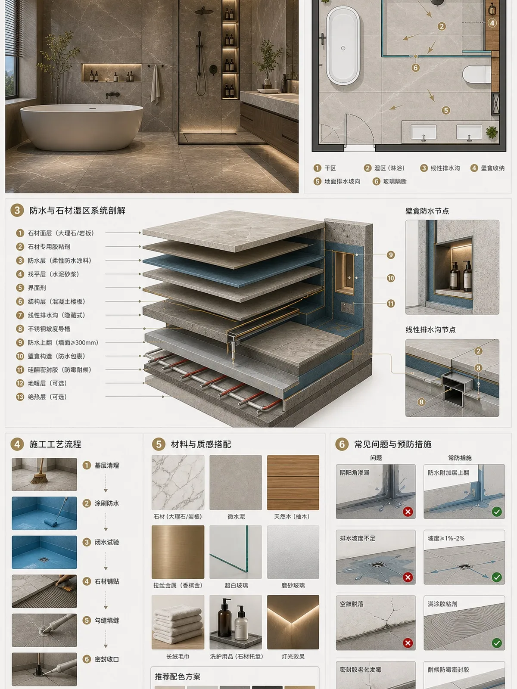

生成一张 3:4 竖版《卫生间防水与石材湿区施工综合展板》，不要只画一张浴室效果图，要把完成效果、平面、构造、工序、材料和问题规避一起展示。

展板模块包括：
1. 左上角：完成后的高端卫生间效果图，含独立浴缸、步入式淋浴、石材墙面、壁龛、隐藏线性地漏、暖色灯带和干湿分区。
2. 右上角：卫生间平面图，显示干区、湿区、浴缸、淋浴、台盆、马桶、玻璃隔断、收纳壁龛和地面找坡方向。
3. 中部：大比例湿区构造爆炸图，展示混凝土基层、找平层、柔性防水、附加防水层、瓷砖胶、石材板、填缝、线性地漏、墙面上翻防水、地暖管和壁龛收边。
4. 左下角：施工流程小图，基层清理、阴角圆弧、防水涂刷、闭水试验、排砖、铺贴、打胶、成品保护。
5. 中下角：材料板，包含石材、微水泥、拉丝金属、玻璃、柚木、防水涂料、瓷砖胶、密封胶和灯光样本。
6. 右下角：常见质量问题规避图，包含阴角渗漏、地漏坡度不足、空鼓、石材返碱、玻璃胶老化和壁龛积水。

视觉要求：施工工艺图 + 高端浴室设计板结合，清晰、专业、可教学；允许编号和箭头，不要大段文字，不要乱码，不要品牌 logo，不要水印。

---

## 03 · 现代中餐厅动线与材质综合展板

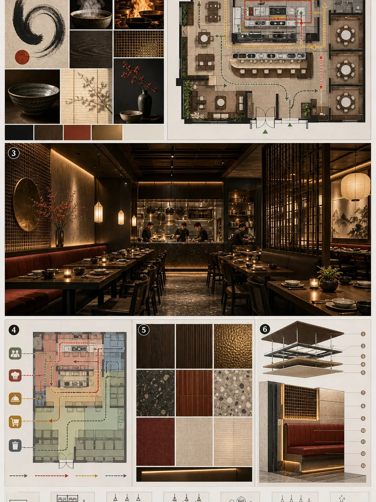

生成一张 3:4 竖版《现代中餐厅动线与材质综合设计展板》，不要只生成餐厅效果图，要同时体现品牌氛围、平面动线、厨房流程、材料和施工节点。

画面模块：
1. 左上角：品牌与情绪拼贴，用陶器、火焰、蒸汽、宣纸、深色木纹、手工砖、黄铜和暖光表达现代东方餐饮气质，不需要真实品牌文字。
2. 右上角：餐厅平面图，包含入口等候、散座、卡座、开放厨房、吧台、包间、收银、后厨和服务通道。
3. 中部：主透视图，夜间营业氛围，开放厨房暖光、卡座、格栅屏风、吊灯、深色木墙、手工砖地面、局部红土色点缀。
4. 左下角：厨房到餐区的动线图，展示备货、粗加工、烹饪、出餐、传菜、回收和清洁路线，用清楚颜色箭头表现。
5. 中下角：材料板，包含深色木饰面、手工砖、锤纹金属、微水泥、织物、纸灯、石材和餐具。
6. 右下角：卡座墙、吸音天花、灯槽、踢脚、墙面收口等施工节点爆炸图。

风格要求：高端餐饮空间设计展板，既有烟火气又有专业度；不要出现大段文字，不要乱码，不要 logo，不要水印。整体色彩为暖黑、陶土红、黄铜、米白和深木色。

---

## 04 · 民宿外立面改造综合展板

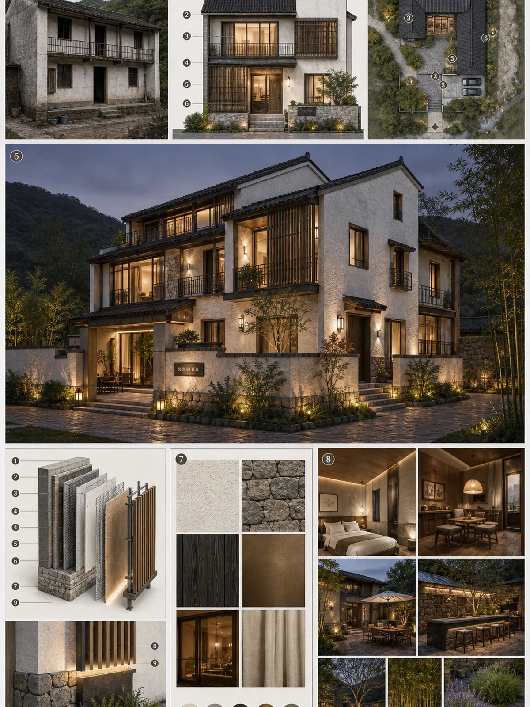

生成一张 3:4 竖版《精品民宿外立面改造综合展板》，不要单独出一张民宿效果图，要把改造逻辑、构造、材料和氛围都放进一张板。

展板内容：
1. 顶部左侧：改造前旧建筑小图，表现朴素乡村建筑、老旧门窗、裸露墙面和周边环境。
2. 顶部中间：改造后立面方案图，展示开窗比例、屋檐、木格栅、入口、阳台、墙面分缝和灯光位置。
3. 顶部右侧：小尺度总平/鸟瞰，包含入口路径、庭院、停车、景观树、休息平台和客房界面。
4. 中部：改造后主透视，傍晚暖光，白色或浅灰石灰基墙面、当地石材基座、深色木格栅、温暖窗光、隐蔽店招、庭院植物。
5. 左下角：外墙构造爆炸图，展示基层、保温、防水、石材基座、石灰基面层、木格栅固定、窗套、隐藏灯带。
6. 中下角：材料板，包含石灰基涂料、当地毛石、炭化木、古铜金属、低铁玻璃、麻布窗帘、暖色灯光。
7. 右下角：民宿情绪板，包含客房灯光、庭院座椅、夜景、植物、水景或山景。

风格要求：乡村更新 + 精品酒店气质，真实但不过度商业，材料细腻，灯光温暖。可用数字标注和引线，避免大段文字、乱码、logo 和水印。

---

## 05 · 无主灯吊顶施工工艺综合展板

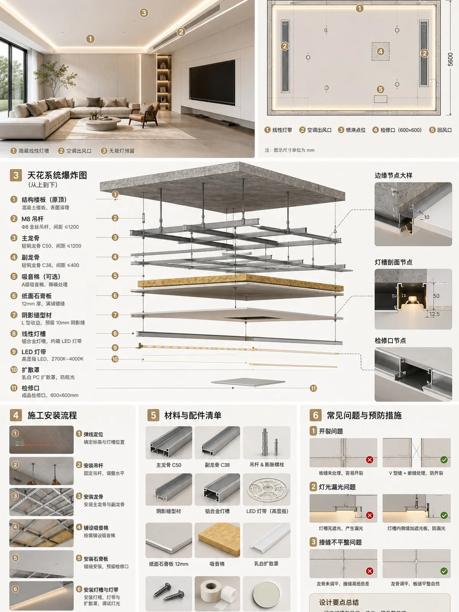

生成一张 3:4 竖版《极简无主灯吊顶施工工艺综合展板》，重点是施工工艺与完成效果结合，不要只画客厅效果图。

展板需要像室内深化设计/施工交底图，白色或浅灰背景，排版干净。必须包含：
1. 左上角：完成后的客厅效果图，展示无主灯天花、隐藏灯槽、线性风口、电视墙、窗帘盒、柔和间接照明。
2. 右上角：反射天花平面图，能看到灯带位置、检修口、空调风口、喷淋/烟感点位和开关回路逻辑。
3. 中部：大比例 3D 爆炸节点，分层展示楼板、吊杆、主龙骨、副龙骨、吸音棉、石膏板、金属阴角条、LED 灯带、扩散罩、检修口。
4. 左下角：施工步骤小图，从弹线定位、吊杆安装、龙骨找平、灯槽预留、封板、防裂处理、批灰喷涂到灯光调试。
5. 中下角：材料五金板，展示龙骨、吊杆、膨胀螺栓、石膏板、灯带、变压器、收边型材、乳胶漆和吸音材料。
6. 右下角：常见问题规避图，包含开裂、漏光、阴角不直、检修口突兀、风口与灯槽冲突。

视觉要求：建筑施工信息图风格，清楚、专业、可教学；允许编号圆点和箭头，不要长段文字，不要乱码，不要品牌 logo，不要水印。

---

## 06 · 屋顶花园空中露台综合展板

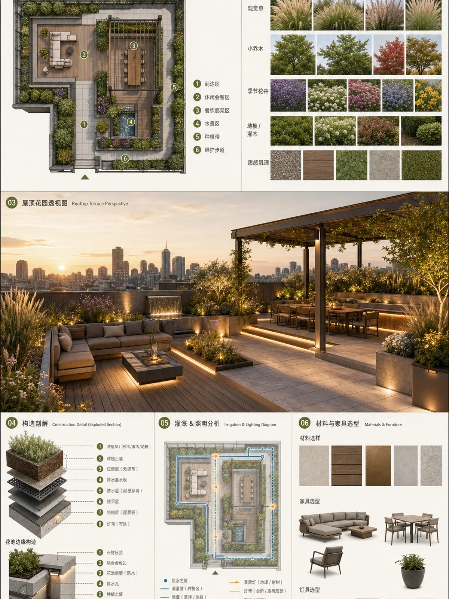

生成一张 3:4 竖版《屋顶花园空中露台综合设计展板》，不要单独出露台效果图，必须同时展示规划、植物、施工层次、材料和灯光。

版式为景观设计方案展板，浅暖灰背景，模块化排版。内容包括：
1. 左上角：屋顶花园规划鸟瞰图，清晰分区：入口、休闲卡座、木平台、餐饮廊架、水景、观景边界、种植带和维护通道。
2. 右上角：植物情绪看板，包含观赏草、小乔木、灌木、季相花境、耐旱地被、盆栽组合和叶片纹理。
3. 中部：黄金时刻主透视，城市天际线背景，木平台、石材铺装、廊架、内嵌座椅、火盆或水景、暖色灯光和植物围合。
4. 左下角：屋面种植构造爆炸图，展示结构板、防水层、保护层、排水板、过滤层、轻质种植土、铺装架空支座、花池收边。
5. 中下角：灌溉与灯光系统图，用简洁色线表现滴灌、排水、线性灯、地埋灯和低位照明。
6. 右下角：材料与家具板，包含防腐木、浅色石材、深色金属、户外布艺、景观灯具、坐凳和花箱。

视觉要求：专业景观事务所出品，真实渲染 + 技术节点 + 材质板；不要出现大段文字，不要乱码，不要 logo，不要水印。整体气质是高端、疗愈、可落地施工。

---

## 07 · 五星级酒店大堂综合设计展板

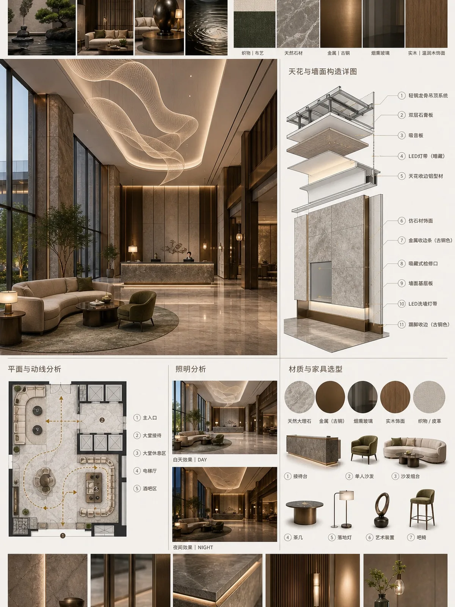

生成一张 3:4 竖版《五星级酒店大堂综合设计展板》，不要只画单张大堂效果图，而是完整展示空间、工艺、材质、灯光和动线。

画面采用高端酒店室内方案汇报板形式，浅米白背景，精密网格排版。必须包含：
1. 顶部情绪看板：石材、深色木饰面、古铜金属、烟熏玻璃、软包皮革、织物、香氛、艺术装置和暖光氛围。
2. 中部左侧：大堂主透视，包含接待台、休息区、行李动线、挑高天花、曲线灯带、艺术墙和电梯厅入口。
3. 中部右侧：墙顶节点爆炸图，展示轻钢龙骨、石膏板、吸音板、石材干挂、灯槽、检修口、金属收边和线性风口。
4. 左下角：平面与动线图，标出入口、接待、等候、休息、电梯厅、吧台和服务后台的关系。
5. 下方中部：日景与夜景灯光分析小图，表现主照明、洗墙光、线性灯、重点照明和氛围光。
6. 右下角：家具与材料样板，包含沙发、边几、地毯、灯具、花器、石材和五金。

风格要求：安静奢华、国际酒店、真实材质、克制高级；画面可以有数字标注和细线引导，但避免长文字，避免乱码，避免廉价广告风，不要 logo，不要水印。

---

## 08 · 城市更新商业街区综合展板

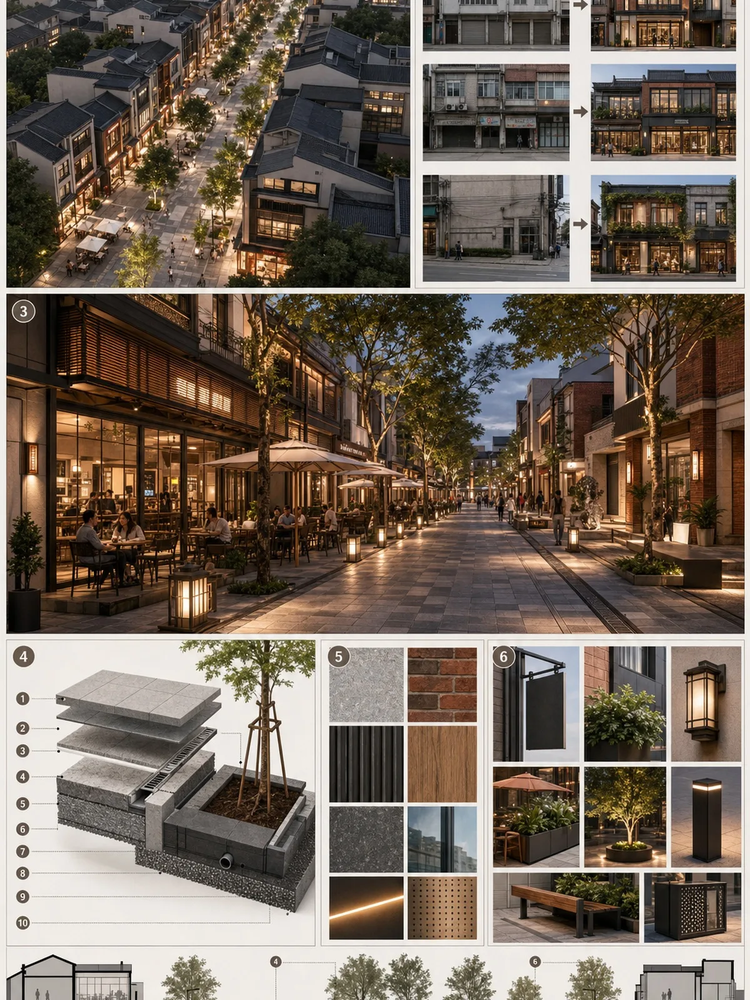

生成一张高端建筑设计公司风格的 3:4 竖版《城市更新商业街区综合方案展板》，不要单独出一张效果图，必须是多模块综合展板。

画面采用干净的网格排版，高级浅燕麦色背景，整体像建筑方案汇报板。内容模块包括：
1. 左上角：商业街区改造后的规划鸟瞰图，能看到步行街、店铺界面、口袋广场、树阵、外摆区和车行边界。
2. 右上角：改造前后对比小图，旧立面、更新后的店招、橱窗、雨棚、二层阳台、夜景灯光各占一个小格。
3. 中部：一张主视觉透视图，傍晚街区，暖色店铺灯光、户外座椅、行人尺度、绿化和铺装细节清晰。
4. 左下角：铺装、排水沟、树池、路缘石、地面找坡的施工节点爆炸图。
5. 中下角：材料板，包含浅灰石材、红砖、深色金属、木纹、玻璃、暖色灯带、耐候钢和植物样本。
6. 右下角：街具与氛围情绪板，包含导视、灯具、座椅、花箱、遮阳伞和夜景氛围。

视觉要求：真实建筑渲染 + 技术图解 + 材质摄影混合；线条克制，层级清晰，模块之间留白均衡。可以使用编号圆点和简短引线，但不要出现大段文字，不要乱码，不要品牌 logo，不要水印。色彩以暖灰、砖红、深古铜、木色和植物绿为主，整体有商业更新项目的专业感。

---

## 09 · 户外铝合金凉亭

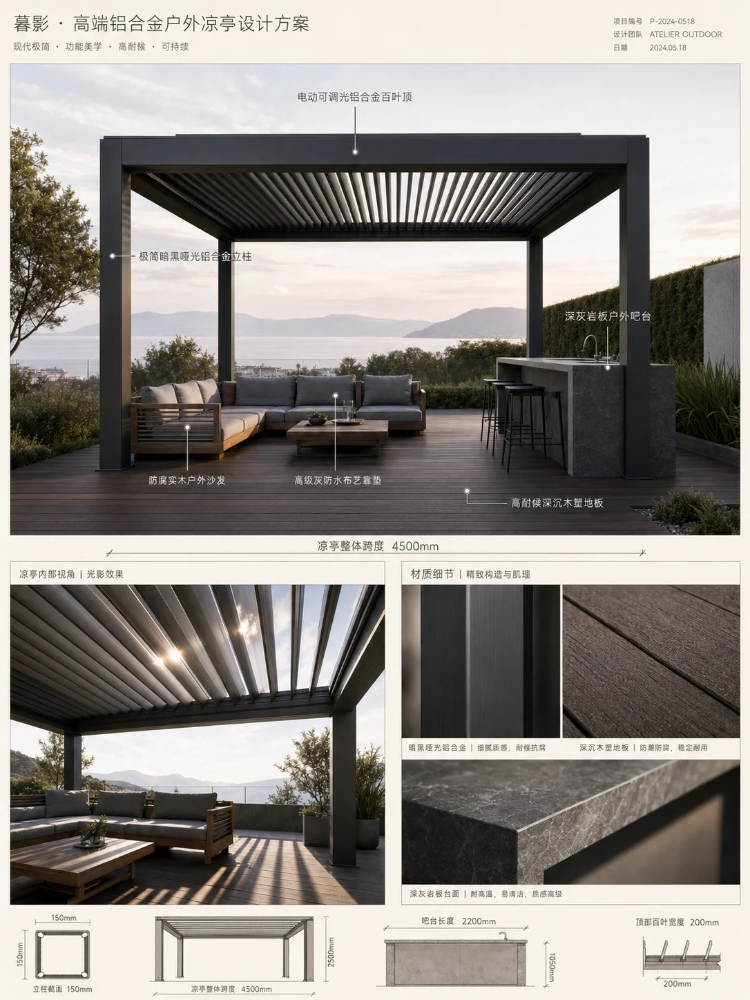

深度拆解核心设计概念的国际化高精度排版矩阵。本全景图摒弃了传统的工程图解方式，以极致理性的制图规范和大师级的光影，详尽呈现了一套高端现代户外铝合金凉亭的设计方案展现图（Design Concept Presentation Board）。比例3:4。采用高端建筑设计的网格排版系统（Grid Layout），在纯净的高级浅燕麦色背景上进行布局。

画面的核心视觉焦点（占据画幅60%）为一张极度写实的全景铝合金凉亭实景透视图，完美展现整体设计方案的空间张力与户外生活方式。视觉中心是一个现代极简的暗黑哑光铝合金结构凉亭，顶部带有可调光的百叶系统。凉亭下方铺设着深沉大地色系的户外高耐候木塑地板，内部布置着一组低调奢华的户外防腐实木沙发与高级灰防水布艺靠垫，并结合深灰岩板打造的户外吧台。画面下方并排嵌套两张次级方案意向图：左侧为凉亭内部百叶透光的极简光影视角特写，右侧为真实微距照片级的材质特写组合（如暗黑铝合金的细腻拉丝质感、深色木塑地板的仿木纹路、深灰岩板台面肌理）。

整体配色极度克制内敛，大面积呈现低饱和度的高级工业灰、深邃的暗沉木纹与暗黑哑光金属色。彻底摒弃CG渲染感，采用徕卡M11相机级别的真实微距胶片摄影质感与清晰的光学景深，精准捕捉自然天光穿透顶部百叶在材质边缘形成的真实高光与柔和的漫反射阴影。核心排版与标注要求：图文排版极其考究，所有空间节点和重要景观元素旁均强制要求使用带有精致极简细线与线框的准确中文注释（如“极简暗黑哑光铝合金立柱”、“电动可调光铝合金百叶顶”、“深灰岩板户外吧台”、“高耐候深沉木塑地板”）。同时，在画面节点上，严格按照建筑制图规范，采用带有45度短斜线端点的极细尺寸线进行详尽的方案级尺度标注，清晰标明诸如“凉亭整体跨度 4500mm”、“立柱截面 150mm”、“吧台长度 2200mm”、“顶部百叶宽度 200mm”等关键空间方案数据。完美融合顶级设计方案汇报的艺术张力与制图的严谨逻辑，8K超高清分辨率

---

## 10 · 黑胡桃实木餐椅

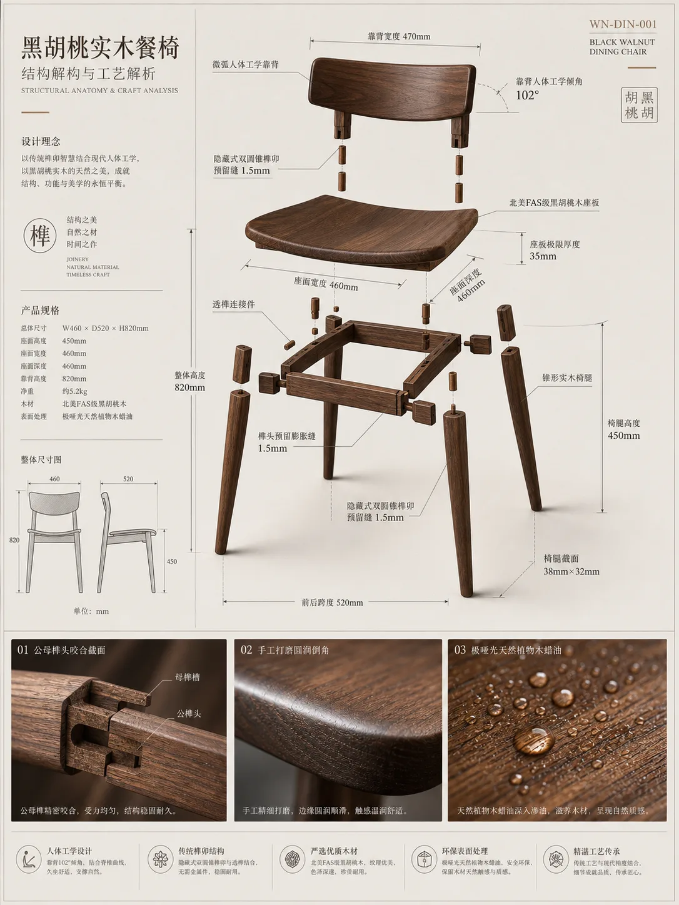

深度透视工业制造美学的殿堂级解析图谱。本画幅彻底脱离了常规的产品宣传范式，在纯净的高级浅燕麦色背景上，依托严密的网格排版法则（Grid Layout），以极度理性的视觉语言将一把现代高定黑胡桃木实木餐椅的内部灵魂彻底剖开。比例3:4。视觉焦点锁定于一张极度写实的3D等轴测爆炸图（Isometric Exploded View），沿空间受力轴线极其精准地悬浮拆解了微弧靠背、马鞍形座板、锥形椅腿以及内部复杂的暗榫与透榫连接件。画幅侧边与下方如同标本陈列般，规则嵌套着三组微距摄影级别的工艺特写：精准的公母榫头咬合截面、手工打磨的极致圆润倒角、以及木蜡油渗透进木材导管的高级肌理。

整体氛围极度沉稳克制，大面积铺陈低饱和度的工业灰、沉静的暗金配件色与深邃的黑胡桃原木色系。彻底剥离3D软件的干瘪渲染感，采用徕卡M11配合中长焦微距镜头捕捉，展现出无可挑剔的胶片摄影质感与细腻的漫反射光学景深。信息传达极其考究，每一个悬浮的实木部件与工艺切片旁，均强制嵌套带有极简细线与线框的准确中文注释（如“北美FAS级黑胡桃木座板”、“隐藏式双圆锥榫卯预留缝”、“极哑光天然植物木蜡油”）。同时，在爆炸图的空间轴线与节点上，严格遵照工业产品制图规范，使用带有45度短斜线端点的极细尺寸线进行详尽且密集的标注，清晰展现诸如“座板极限厚度 35mm”、“靠背人体工学倾角 102°”、“榫头预留膨胀缝 1.5mm”等核心制造数据。完美融合顶级智造逻辑与大师级实木微距张力，8K超高清比例

---

## 11 · 公寓下沉空间设计

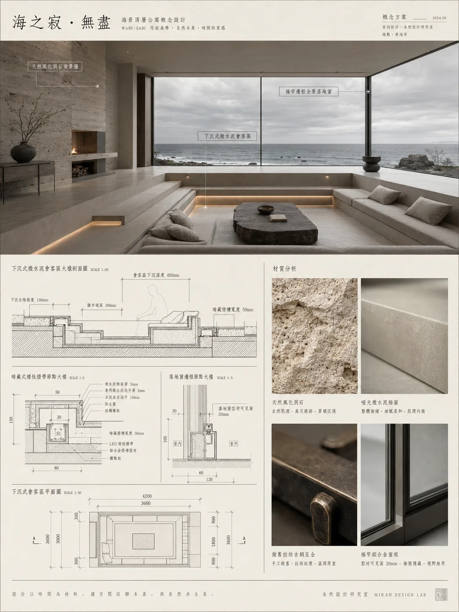

极具电影级叙事感的高端设计蓝图与实景透视排版 。本画幅采用严密的网格系统（Grid Layout），在纯净的高级浅燕麦色背景上，以极具克制感的视觉语言深度解析一个国际殿堂级的顶级侘寂风（Wabi-sabi）海景大平层室内空间 。比例3:4 。画面自上而下流畅衔接三大核心内容：上半部分占据视觉中心，为一个极度写实的人视角3D室内氛围效果图，完美展现极致开阔的下沉式会客区，巨大的全景落地玻璃窗外是深邃的灰色海景 。左下侧为高精度的室内剖面节点大样图，精准解析下沉式微水泥台阶的无缝收口与暗藏式灯带结构 。右下侧整齐排列几组真实微距照片级的材质特写，包含粗粝的天然风化洞石、细腻的哑光微水泥肌理与做旧的拉丝古铜五金特写 。

整体配色极度克制内敛，大面积呈现低饱和度的高级工业灰、斑驳的侘寂沙色与深邃的暗沉大地色系 。彻底摒弃CG渲染感，采用徕卡M11相机级别的真实微距胶片摄影质感与清晰的光学景深，精准捕捉自然天光与室内柔和漫反射的深度交融 。图文排版极其考究，所有空间节点、剖面图和材质大样旁均强制要求使用带有精致极简细线与线框的准确中文注释（如“下沉式微水泥会客区”、“天然风化洞石背景墙”、“极窄边框全景落地窗”） 。同时，在剖面节点和结构上，严格按照人体工程学与建筑制图规范，采用带有45度短斜线端点的极细尺寸线进行详尽且密集的标注，清晰标明诸如“下沉台阶高度 150mm”、“暗藏灯槽宽度 50mm”、“落地窗型材可见面 20mm”等关键设计规范数据 。完美融合空间艺术张力与工程制图的严谨逻辑，8K超高清分辨率.

---

## 12 · 器物产品展示

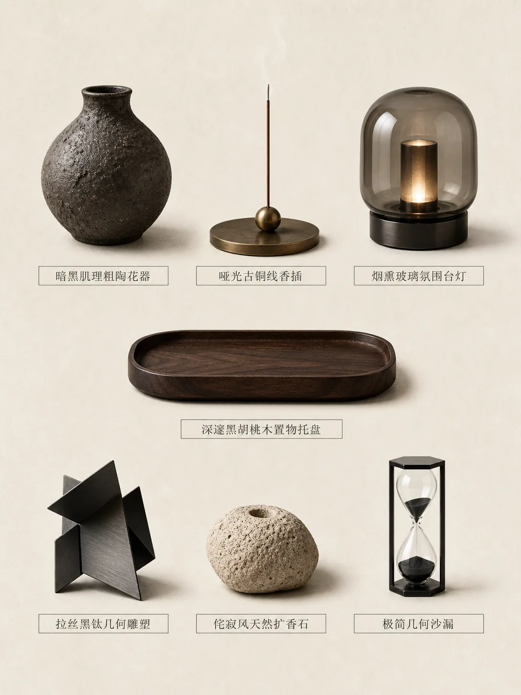

深度拆解核心设计概念的国际化高精度排版矩阵 。本全景图摒弃了传统的商品展示方式，以极致理性的视觉秩序和大师级的光影，详尽呈现了一套高端现代极简家居陈设商品展示看板（Product Presentation Board） 。比例3:4 。采用高端设计杂志的网格平铺排版系统（Grid Layout），在纯净的高级浅燕麦色背景上进行布局 。

画面中规则且极具美感地整齐排列着7种不同材质的高端家居陈设商品：暗黑肌理粗陶花器、哑光古铜线香插、烟熏玻璃氛围台灯、深邃黑胡桃木置物托盘、拉丝黑钛几何雕塑、侘寂风天然扩香石以及极简几何沙漏。整体配色极度克制内敛，大面积呈现低饱和度的高级工业灰、暗沉的大地色系与暗黑哑光金属色 。彻底摒弃CG渲染感，采用徕卡M11相机配合中长焦镜头，展现出真实的微距胶片摄影质感与清晰的光学景深，利用具有方向性的影棚均匀漫反射光影，深刻凸显每一种商品独特的表面导管、天然凹凸肌理与高级哑光反光 。

核心排版与标注要求（极度重要）：画面中绝对不要出现任何尺寸数据标注，绝对不要出现任何指向性引线或箭头！ 仅仅在每一款商品的正下方，强制要求使用一个精致极简的细边框，在细边框内部仅用高级的排版字体写出准确的中文商品名称（如“暗黑肌理粗陶花器”、“烟熏玻璃氛围台灯”、“深邃黑胡桃木置物托盘”等对应的7个名称） 。完美融合高端产品画册的极简留白艺术与大师级材质摄影震撼，画面干净、通透且极具国际专业感，8K超高清分辨率，--ar 3:4

---

## 13 · 云亭观山中餐厅方案 

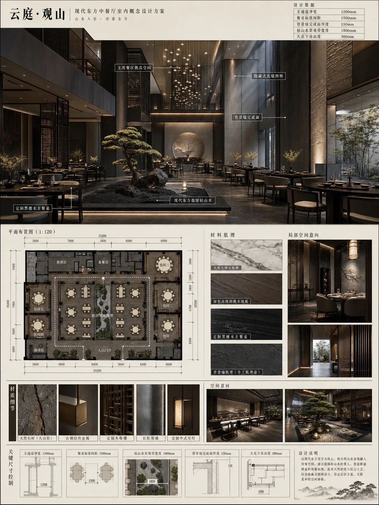

深度拆解核心设计概念的国际化高精度排版矩阵 。本全景图摒弃了传统的展示方式，以极致理性的制图规范和大师级的光影，详尽呈现了一套低调内敛的现代东方奢华风中式餐厅概念设计汇报稿（Concept Design Presentation Board） 。比例3:4 。采用高端建筑设计的网格排版系统（Grid Layout），在纯净的高级浅燕麦色背景上进行布局 。

画面自上而下流畅衔接三大核心内容：上半部分占据视觉中心，为一个极度写实的人视角3D室内氛围效果图，展示挑高天花板下的主用餐区与静谧的室内微缩枯山水景观 ；中部左侧平滑过渡为具有丰富材质细节的彩色顶视平面图，呈现精确的空间布局与家具结构线条 ；中部右侧及底部整齐排列着几组真实微距照片级的材质特写与局部空间小透视（如天然大理石的纹理、深色高级胡桃木地板以及黑檀木茶桌的细腻材质） 。

整体配色极度克制内敛，大面积呈现低饱和度的高级工业灰、暗沉的大地色系与深邃的原木色 。彻底摒弃CG渲染感，采用徕卡M11相机级别的真实微距胶片摄影质感与清晰的光学景深，精准捕捉高级的隐藏式照明和戏剧性的丁达尔光影效果 。核心排版与标注要求：图文排版极其考究，所有空间节点、平面图和材质样板旁均强制要求使用带有精致极简细线与线框的准确中文注释 （如“现代东方微缩枯山水”、“定制黑檀木主餐桌”、“天然大理石肌理”）。同时，在图表和节点上，严格按照建筑制图规范，采用带有45度短斜线端点的极细尺寸线进行详尽且密集的标注 ，清晰标明诸如“主通道净宽 1200mm” 、“餐桌标准间距 1500mm”、“背景墙完成面厚度 150mm”等关键设计规范数据。完美融合东方美学的严谨逻辑与大师级空间摄影张力，8K超高清分辨率，--ar 3:4 。

---

## 14 · 奢华孤岛太空舱概念图

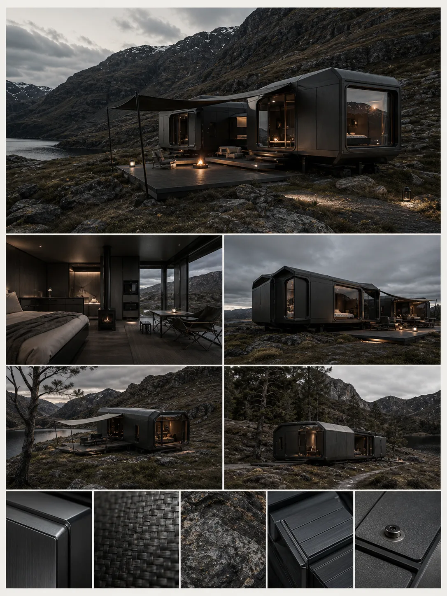

极具电影级叙事感的高端实景透视排版完美结合的图解看板（Presentation Board）。本全景图摒弃了传统的工程图解与文字标注方式，以极致理性的视觉逻辑和大师级的光影，详尽呈现了一套高端野奢荒野露营地的设计方案展现图。比例3:4 。

核心指令：完全摒弃任何排版系统中的文字说明、尺寸标注或指示线框，呈现一张100%纯粹由空间视图与细节组成的视觉看板 。画面采用高端建筑设计的网格排版系统（Grid Layout），在纯净的高级浅燕麦色背景上进行纯图像布局。

画面被优雅地划分为多个纯视觉模块：核心视觉焦点（占据画幅60%）为一张极度写实的全景荒野营地实景透视图，完美展现科技游牧主义在自然中的“受控降临”。视觉中心是极其硬核的暗黑哑光钛合金与深灰碳纤维打造的模块化舱体，坐落于粗粝的原始自然地貌中。画面下方及侧边规则嵌套着多个次级角度与微观细节图：包括舱体内部的极简游牧生活场景视角、不同角度的自然环境（如幽暗森林或悬崖边缘）透视，以及整齐排列的真实微距照片级材质特写（如钛合金的细腻拉丝表面、深灰碳纤维骨架的编织纹理、粗粝天然岩石的真实肌理）。

整体配色极度克制内敛，大面积呈现低饱和度的高级工业灰、暗黑哑光金属色与深邃的大地色系 。彻底摒弃CG渲染感，采用徕卡M11相机配合不同焦段镜头拍摄，精准捕捉自然天光在材质边缘的真实高光与粗粝自然环境的柔和漫反射阴影，展现无与伦比的光学景深 。完美融合顶级设计方案的纯粹视觉震撼，8K超高清分辨率，--ar 3:4 。

---

## 15 · 现代极简庭院设计方案

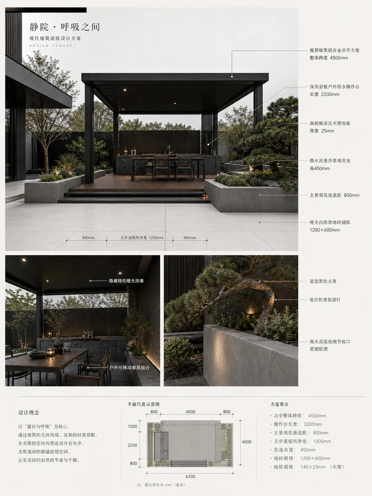

深度拆解核心设计概念的国际化高精度排版矩阵。本全景图摒弃了传统的工程图解方式，以极致理性的制图规范和大师级的光影，详尽呈现了一套高端现代极简庭院的“设计方案展现图”（Design Concept Presentation Board）。比例3:4。采用高端建筑设计的网格排版系统（Grid Layout），在纯净的高级浅燕麦色背景上进行布局。画面的核心视觉焦点（占据画幅60%）为一张极度写实的全景庭院实景透视图，完美展现整体设计方案的空间张力与生活方式。

视觉中心是一个极简的暗黑铝合金结构凉亭，下方铺设着深沉大地色系的户外木塑地板，并结合深灰岩板打造的户外防水操作台；周边环绕着高级灰微水泥砌筑的错落花池。地面大面积铺设哑光质感的纯白防滑地砖，与深色建筑体块形成极具呼吸感的高级对比。画面下方并排嵌套两张次级方案意向图：左侧为凉亭内部的休闲生活场景特写，右侧为花池与造型黑松交接的微距光影氛围图。整体配色极度克制内敛，在纯白地砖的衬托下，大面积呈现低饱和度的高级工业灰、深邃的暗沉木纹与暗黑哑光金属色。彻底摒弃CG渲染感，采用徕卡M11相机级别的真实微距胶片摄影质感与清晰的光学景深，精准捕捉自然天光在材质边缘的真实高光与植物的柔和漫反射阴影。

核心排版与标注要求：图文排版极其考究，所有空间节点和重要景观元素旁均强制要求使用带有精致极简细线与线框的准确中文注释（如“极简暗黑铝合金凉亭方案”、“深灰岩板户外防水操作台”、“微水泥悬浮景观花池”、“高耐候深沉木塑地板”、“哑光白防滑地砖大面积铺陈”）。同时，在画面节点上，严格按照景观制图规范，采用带有45度短斜线端点的极细尺寸线进行详尽的方案级尺度标注，清晰标明诸如“凉亭整体跨度 4500mm”、“操作台长度 2200mm”、“主景观花池退距 800mm”、“主步道视线净宽 1200mm”等关键空间方案数据。完美融合顶级设计方案汇报的艺术张力与制图的严谨逻辑，8K超高清分辨率，--ar 3:4。

---

## 16 · 时间痕迹与现代工业的碰撞

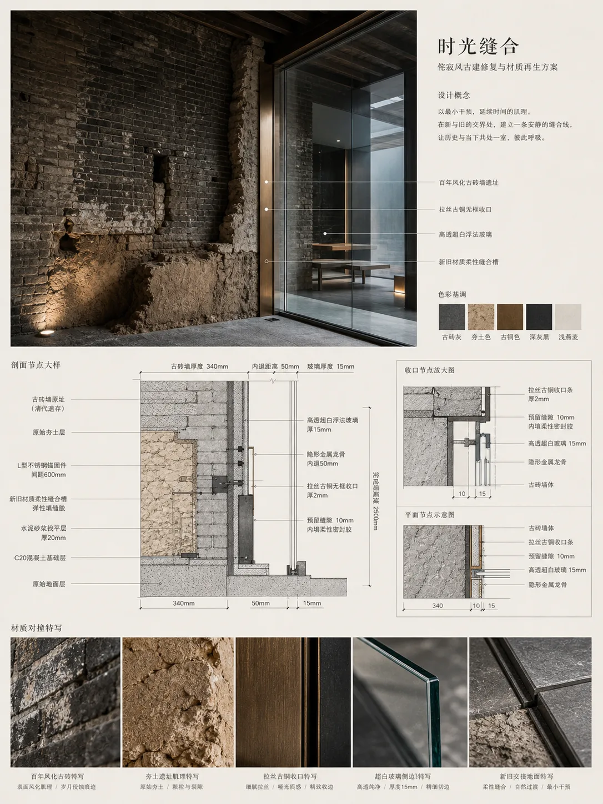

深度拆解核心设计概念的国际化高精度排版矩阵。本全景图摒弃了传统的展示方式，以极致理性的制图规范和大师级的光影，详尽呈现了一套低调内敛的“时光缝合”侘寂风古建修复与材质再生方案。比例3:4。采用高端建筑设计的网格排版系统（Grid Layout），在纯净的高级浅燕麦色背景上进行布局。

画面自上而下流畅衔接三大核心内容：上半部分占据视觉中心，为一个极度写实的局部空间意向图，呈现跨越时代的肌理对话，一半展现斑驳风化、历经风霜的百年古砖墙与夯土遗址，一半展现使用极其克制手法“缝合”进去的现代极致平滑的高透超白玻璃与拉丝古铜材质；中部为高精度的剖面节点大样图，精准拆解新旧材质交接的隐藏式收口工艺；底部整齐排列着真实微距照片级的材质对撞特写。整体配色极度克制内敛，大面积呈现低饱和度的高级工业灰、暗沉的大地色系夯土色、斑驳的青砖色与深邃的暗黑哑光金属色。彻底摒弃CG渲染感，采用徕卡M11相机级别的真实微距胶片摄影质感与清晰的光学景深，放大岁月的张力，精准捕捉现代工业反光材质的真实高光与历史肌理的深邃漫反射阴影。

核心排版与标注要求：图文排版极其考究，所有新旧材质交接节点、剖面图和局部大样旁均强制要求使用带有精致极简细线与线框的准确中文注释（如“百年风化古砖墙遗址”、“高透超白浮法玻璃”、“拉丝古铜无框收口”、“新旧材质柔性缝合槽”）。同时，在剖面节点和空间大样上，严格按照建筑制图规范，采用带有45度短斜线端点的极细尺寸线进行详尽且密集的标注，清晰标明诸如“古砖墙厚度 340mm”、“古铜收口预留缝隙 10mm”、“超白玻璃厚度 15mm”、“隐形金属龙骨内退 50mm”等关键修复工程数据。完美融合古建修复工程图解的严谨逻辑与大师级跨时代材质摄影张力，8K超高清分辨率，--ar 3:4。

---

## 17 · 照明系统分析图

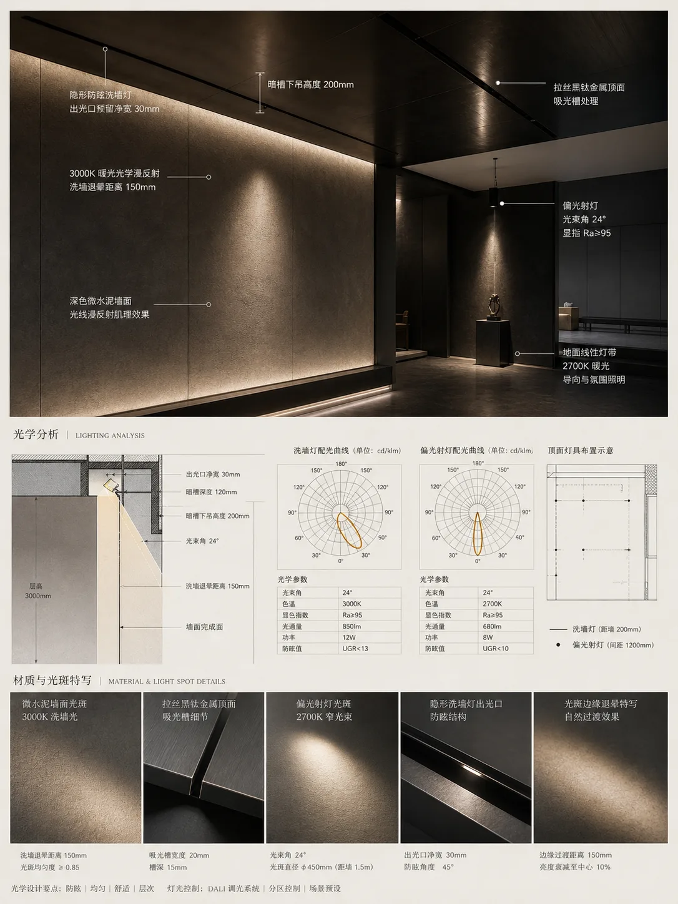

呈现殿堂级视觉张力的单幅微距摄影与排版艺术完美结合的图解看板（Presentation Board） 。本画幅采用严密的网格系统（Grid Layout），在纯净的高级浅燕麦色背景上，以极具克制感的视觉语言深度解构空间中极难表现的隐形照明与光学现象 。比例3:4 。

画面自上而下流畅衔接三大核心内容：上半部分占据视觉中心，为一个极其深邃的局部空间意向图，将光线本身作为建筑材料进行拆解，展现不同色温的隐形洗墙灯与偏光射灯打在深色哑光微水泥墙面与拉丝黑钛金属顶面上的真实光学漫反射现象，呈现极具戏剧性的明暗对比；中部为高度专业的光学分析模块，结合空间节点直接叠加光束角的几何虚线图解与精确的配光曲线图表（Photometric Web）；底部整齐排列着真实微距照片级的材质与光斑特写，精准捕捉光斑边缘的极致退晕细节与金属表面的物理高光。整体配色极度克制内敛，大面积呈现低饱和度的高级工业灰、暗沉的大地色系与深邃的暗黑哑光金属色 。彻底摒弃CG渲染感，采用徕卡M11相机级别的真实微距胶片摄影质感与清晰的光学景深，完美还原光的物理衰减与漫反射深邃阴影凹槽 。

核心排版与标注要求：图文排版极其考究，所有光学节点、配光图表和局部大样旁均强制要求使用带有精致极简细线与线框的准确中文注释（如“隐形防眩洗墙灯”、“3000K暖光光学漫反射”、“拉丝黑钛金属吸光槽”、“光斑边缘退晕特写”） 。同时，在光学节点和空间剖面上，严格按照建筑制图规范，采用带有45度短斜线端点的极细尺寸线进行详尽且密集的标注，清晰标明诸如“洗墙退晕距离 150mm”、“光束角 24°”、“出光口预留净宽 30mm”、“暗槽下吊高度 200mm”等关键工程与光学数据 。完美融合照明工程图解的严谨性与大师级光影微距摄影张力，8K超高清分辨率，--ar 3:4 。

---

## 18 · 酒店配色与材质方案 

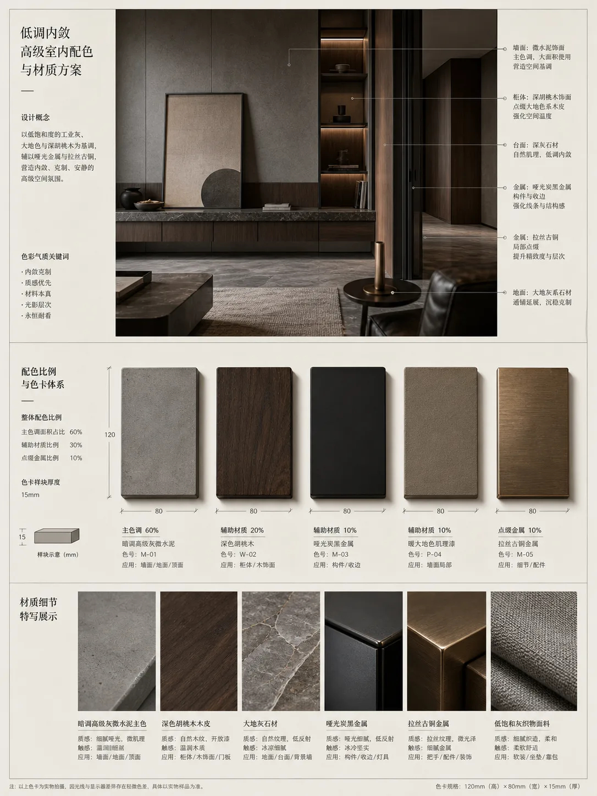

深度拆解核心设计概念的国际化高精度排版矩阵 。本全景图摒弃了传统的展示方式，以极致理性的制图规范和大师级的光影，详尽呈现了一套低调内敛的高级室内配色与材质方案 。比例3:4 。采用高端建筑设计的网格排版系统（Grid Layout），在纯净的高级浅燕麦色背景上进行布局 。

画面自上而下分为三个核心模块 ：顶部为一个极度写实的局部空间意向图，展示色彩在实际空间中的光影反馈；中部为一组按比例切割的厚重实体漆面色卡标本（Color Swatches）；底部整齐排列着真实微距照片级的材质特写 。整体配色极度克制内敛，大面积呈现低饱和度的高级工业灰、暗沉的大地色系、深邃的原木色与暗黑哑光金属色 。彻底摒弃CG渲染感，采用徕卡M11相机级别的真实微距胶片摄影质感与清晰的光学景深，精准捕捉材质边缘的真实高光与漫反射深邃阴影 。

核心排版与标注要求：图文排版极其考究，所有色块、材质样板和空间节点旁均强制要求使用带有精致极简细线与线框的准确中文注释 （如“暗调高级灰微水泥主色”、“大地色系胡桃木点缀”、“拉丝古铜辅助金属色”）。同时，在图表和节点上，严格按照建筑制图规范，采用带有45度短斜线端点的极细尺寸线进行详尽且密集的标注 ，清晰标明诸如“主色调面积占比 60%”、“辅助材质比例 30%”、“色卡样块厚度 15mm”等关键设计规范数据 。完美融合品牌设计的严谨逻辑与大师级材质摄影质感，8K超高清分辨率，--ar 3:4 。

---

## 19 · 转角节点施工大样

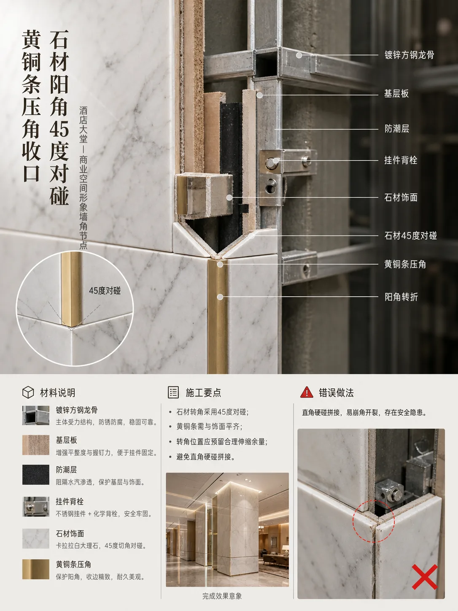

创作一张转角节点施工大样讲解图,主题是石材阳角 45 度对碰、黄铜条压角收口,应用于酒店大堂或商业空间形象墙的转角部位。整张图采用真实摄影质感,看起来像实景拍摄结合剖切展示的混合画面,大理石呈现真实的纹理与光泽,黄铜条带有细腻的金属质感,内部钢架龙骨流露工业感,转角处被切开,清晰露出内部各层构造的层次关系,类似建筑工艺纪录片里那种"剖开一面看内部"的镜头质感,有景深、有光影、有材料颗粒感。画面排版上,转角节点本身作为主视觉位于画面中心偏上,占据约 60% 的视觉重量,关键部位用细引线或圆圈引出文字标注,画面侧边或下方留出一块干净的留白区域,放置中文的材料说明和施工要点文字,画面的一个小角落放一张错误做法对比的真实剖切小图作为辅助参考。整体气质参考日本工艺类纪录片的精细切面展示和高端设计公众号的封面视觉,专业、克制、有质感,所有标注与说明使用全中文,画幅为竖版 3:4。

---

## 20 · 云栖庭 · YUNQI COURT

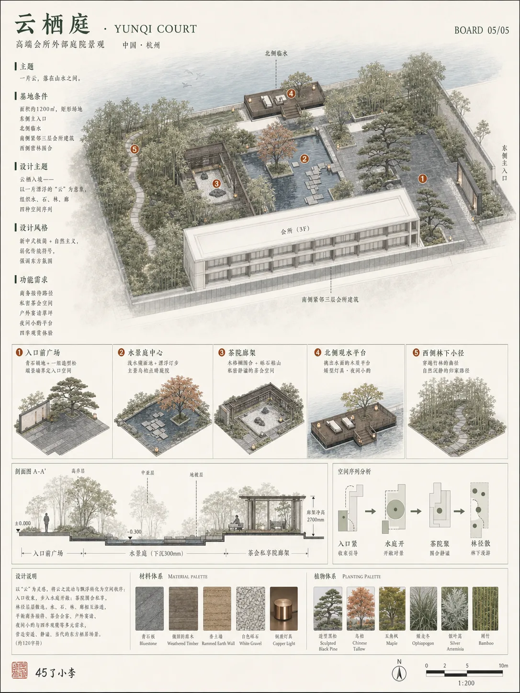

《景观设计展示板》专业方案提示词

【用户输入】

项目名称：云栖庭 · YUNQI COURT。项目类型：高端会所外部庭院景观。场地条件：面积约 1200㎡，矩形场地，东侧主入口，北侧临水，南侧紧邻三层会所建筑，西侧密林围合。设计主题：云栖入境——以一片漂浮的"云"为意象，组织水、石、林、廊四种空间序列。设计风格：新中式极简 + 自然主义，弱化传统符号，强调东方氛围。功能需求：商务接待路径、私密茶会空间、户外宴请草坪、夜间小酌平台、四季观赏体验。主色调：低饱和墨绿 #2F4F3A + 暖灰 #B5AFA6。辅助色：原木色 #C9A878、米白 #F4EFE8、青石灰 #6E6F6B。点缀色：锈铜色 #8B5A3C（用于灯具与小品标识）。画幅比例：竖版 3:4。

【创作目标】

这是"云栖庭"项目的第 01 号方案展示板，模拟向高端会所甲方提案时使用的作品集级展板。要呈现：总体轴测布局、4 个关键节点意象、1 个剖面、材料色板、设计概念图示、文字说明。

【核心视觉要求】

1. 主图采用轴测图（45°视角），展示整个庭院布局：入口前广场（青石铺地 + 一组造型松）、中部水景庭（浅水镜面池 + 漂浮汀步 + 一棵主景乌桕）、茶会私享院（围合廊架 + 矮墙 + 砾石枯山）、北侧观水平台（挑出水面的木质平台 + 矮型灯具）、西侧林下小径（穿越竹林的曲径）。线稿基础 + 淡彩填充，不要写实材质，要"图纸 + 插画"的混合感。

2. 4 张节点意象小图（扁平轴测/插画风格）：入口前广场（松树 + 青石 + 端景墙）、水景庭中心（乌桕 + 水镜 + 汀步）、茶院廊架（木格栅 + 砾石 + 矮灯）、林下小径（竹林剪影 + 石板路）。

3. 1 张剖面图：横向切过水景庭与茶院，表现地形微落差（-300mm 下沉水景）、植物层次（高乔-中亚-地被）、构筑物尺度（廊架净高 2700mm）。黑白线稿 + 极淡墨绿色块。

4. 材料/植物色板：材料包括青石板、做旧防腐木、夯土墙、白色砾石、铜质灯具；植物包括造型黑松、乌桕、五角枫、矮麦冬、银叶蒿、刚竹。每个色板小方块 + 中英文名称标注。

5. 设计概念图示：一张"由密到疏"的空间序列分析图（入口紧 → 水庭开 → 茶院聚 → 林径散），抽象几何图形，极简。

6. 文字说明：标题"云栖庭 YUNQI COURT"，概念句"一片云，落在山水之间。"，设计说明 120 字短文，节点编号 ①②③④⑤。

【版式与结构】

顶部信息条：项目名 + 类型 + 区位（模拟"中国 · 杭州"）+ BOARD 05/05。主图区：轴测图居中，占画面 55%。辅图区：右侧或下方网格排列 4 张节点小图 + 1 张剖面 + 1 张概念图。信息说明区：底部条带，左侧设计说明，中间色板，右侧植物表。收口区：左下设计师署名章（"45了小李"），右下指北针、比例尺（1:200）。

【排版要求】

12 列网格对齐，所有图块严格栅格化。视觉层级：轴测主图 > 节点小图 > 剖面 > 文字 > 标注。中英文混排，简体宋体 + Inter。留白 25%。整板墨绿 + 暖灰 + 米白主导，锈铜仅用在 logo、印章、灯具标记。

【风格气质参考】

张唐景观、山水比德、一宇设计、朱育帆工作室的提案板视觉语言。克制、文人、专业、当代东方。

【质量要求】

看上去像一张可以直接打印 A1 挂在会所甲方评审墙上的真实提案板。信息完整、风格统一、排版严谨、留白克制。

请输出一张竖版 3:4 高完成度的新中式景观设计展示板。

---

## 21 · 煮见

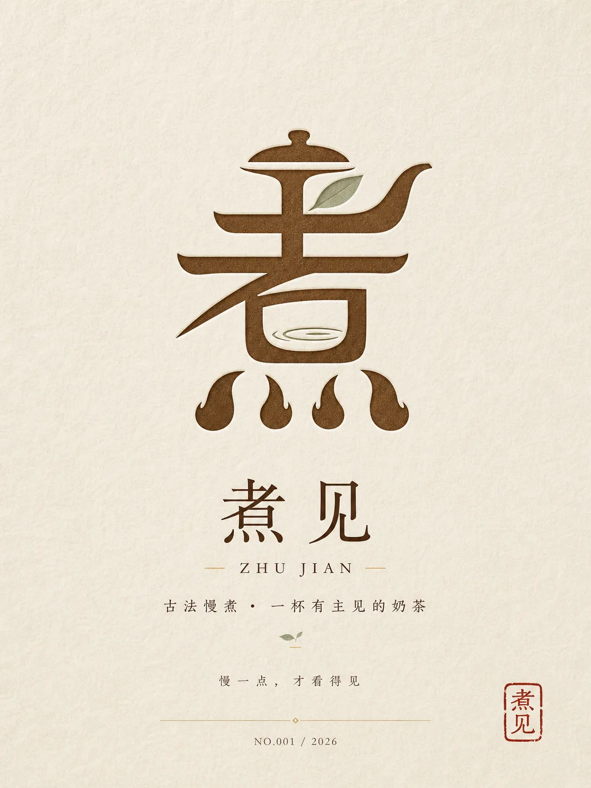

请根据用户输入的【主题】【品牌名】【风格方向】【主色调】【画幅比例】，创作一张高完成度的「汉字意象徽记 / Hanzi Emblem Marks」风格视觉作品。

【用户输入】

主题文字 / 核心汉字：煮。品牌名 / 名称：煮见 ZHU JIAN。副标题 / 产品名：古法慢煮·一杯有主见的奶茶。短句文案 / 释义：慢一点，才看得见 / 一火一茶，煮见本味。风格方向：东方极简徽记、文人极简、宋式雅致、字图融合、留白克制。主色调：墨褐（类似熬煮糖色 #5E3A1F）。辅助色：温米白（纸面感 #F4EBDD）、淡茶绿（嫩芽色 #A8B89A）。点缀色：朱印红（印章用 #B53A2A）、微烫金（细节描边 #C9A961）。画幅比例：3:4 竖版（适合社媒发布与作品集展示）。

【创作目标】

这不是普通海报，不是书法作品，也不是复杂国潮插画，而是一张以"汉字图形化标志"为核心的中式简约标志展示图。请将"煮"作为核心视觉主体，把汉字结构与其语义相关的东方意象进行图形融合，使其同时具备"可读性、图形性、识别度、品牌感、文化气质"。

【核心视觉要求】

1. 以"煮"字为骨架，进行图形化重构。重点保留"煮"字的辨识度，远看必须是"煮"字，近看能发现意象。

2. 主视觉必须是一个高识别度的汉字图形标志，看起来像可以真实用于茶饮品牌、文创、产品包装中的标志系统。

3. 图形融合方向（围绕"煮"的语义，选 1-2 种自然融入，不要堆砌）："煮"字下方的四点底（灬）可化为火苗或茶蒸汽；"煮"字上部的"耂"可融入茶壶口、茶汤波纹或茶叶轮廓；中间的"日"可演变为茶碗侧视、月、印章方框；整体可与一只极简茶器（壶/碗/杯）轮廓共生。

4. 保持"字即图，图即字"的关系：远看是一个完整 logo，近看能发现字形与煮茶意象结合。

5. 整体风格中式、简约、克制、雅致、留白充足。避免廉价国潮感，避免龙凤祥云堆砌，避免土味毛笔笔触。

6. 色彩以低饱和为主，主用墨褐与温米白，茶绿做点缀，朱红仅用于小印章。

7. 背景使用宣纸米白质感，可有轻微压印感、细腻纸张肌理。不要 3D 效果、不要光影特效。

8. 画面以"logo 展示图"逻辑组织，像设计师作品集中的提案稿。

【版式与结构要求】

主标志区：画面中上部放置"煮"字图形 Logo，占画面视觉重心 40-50%。名称识别区：Logo 下方放置中文"煮见"两字（宋体或仿宋，克制），再下方一行小字英文"ZHU JIAN"或拼音作为补充。文案说明区：画面中下部放置"古法慢煮·一杯有主见的奶茶"作为副标题（小字号），底部一句释义文案"慢一点，才看得见"。细节收口区：画面右下角或左下角加一枚朱红小印章（印文"煮见"或"慢"字），并加细线分隔符、编号（如 NO.001 / 2026）、小型注释。

【排版要求】

采用中轴对称式构图，主标志居中。保持 60% 以上留白，不要塞满信息。视觉层级：主标志最大 → 品牌名次之 → 副标题再次 → 释义和拼音较小 → 印章和编号最小。版面具有作品集展示感、轻提案感、东方徽记感。英文极少量出现，仅作识别补充，不要破坏中式气质。

【风格气质参考】

中式极简、宋式雅致、字图融合、印章气质、文人感、品牌感、安静、克制、收藏感。参考方向：原研哉的无印良品式留白 + 朱赢椿的书籍设计 + 日本"茅乃舍"品牌的克制东方感。

【质量要求】

生成结果应精致、清晰、结构完整，具有成熟品牌提案的完成度。重点不是炫技，而是"一个可被长期复用的中式汉字图形标志展示系统"。

请输出一张统一风格、高完成度、3:4 竖版、适合社媒发布与作品集展示的视觉作品。

---

## 22 · 大型机场白模渲染图

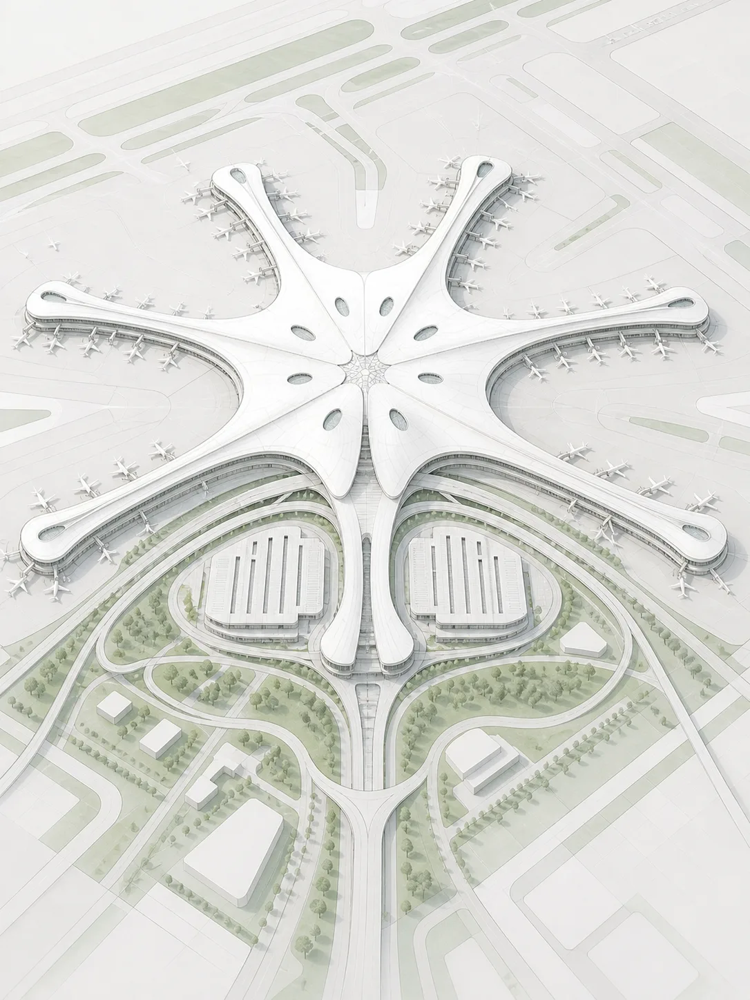

生成一张等距轴测视角的{北京大兴机场}的概念建筑白模渲染图 
使用简化的白模搭配极简化的周边环境，参考BIG事务所经典的分析图表达风格
使用AO效果和细线轮廓描边
整体风格清新自然，无任何文字
使用饱和度较低的色彩为周边环境填色，如道路浅灰，植物浅绿，建筑保持白色
3:4竖版图片

---

## 23 · 普利茨克奖获奖建筑作品

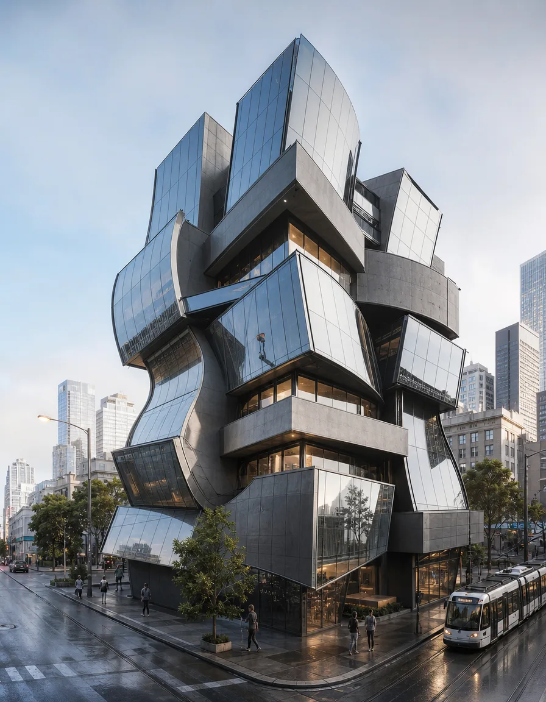

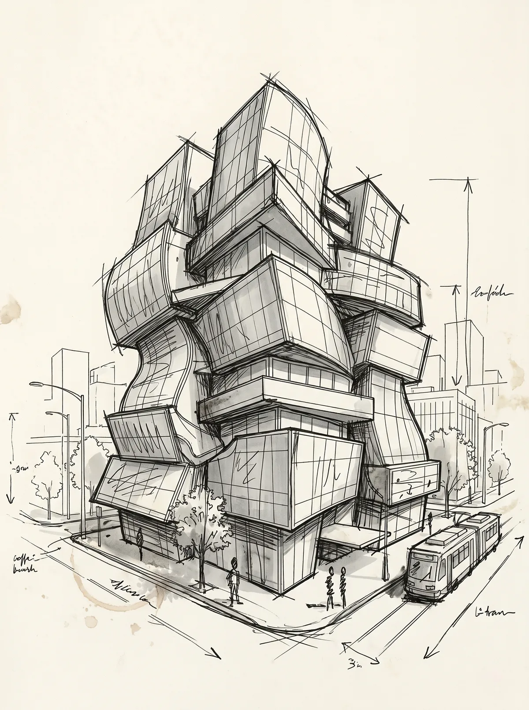

一张极具建筑大师水准的超现代城市综合体实景摄影图，灵感源自上传的建筑草图，将其手绘线条完美转化为具有流动感与雕塑感的写实建筑形态。比例 3:4，采用单张画幅展现毫无瑕疵的真实照片质感，完全摒弃传统 CG 渲染感，呈现极高的国际设计张力。

核心指令：完全摒弃任何排版系统、文字说明、尺寸标注或线框，呈现一张 100% 纯粹的全幅视觉图像。

建筑立面由一系列具有参数化波浪起伏的体块堆叠而成，展现出"受控的混乱"之美。外墙材质采用低饱和度的高级哑光微水泥与深灰色天然石材，结合大面积的超白反射玻璃幕墙，倒映着清晨微冷的天光。整体配色极度克制内敛，呈现高级工业灰与暗沉的大地色系。

利用徕卡 M11 相机配合 24mm 广角镜头拍摄，捕捉自然的晨曦漫反射光影，清晰展现出混凝土表面的细微颗粒感与金属收边的真实拉丝质感。

画面背景为真实的城市场景，建筑与周围环境完美融合，街道上带有自然的动态感。配合极具专业感的光学景深、细腻的材质漫反射以及柔和的丁达尔效应，呈现大师级建筑摄影的纯粹视觉震撼，8K 超高清分辨率。

---

## 24 · 户外木塑底部安装工艺

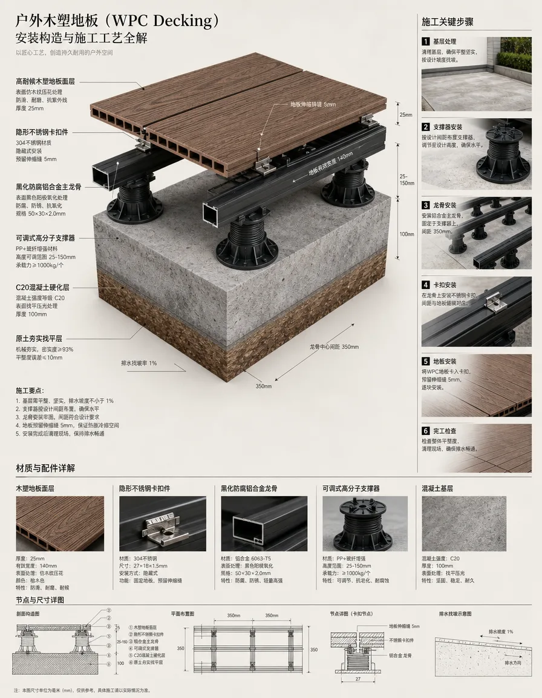

作为一份具备国际顶级建筑标准的图文信息全景矩阵（Infographic Presentation Board），画面通过极其考究的简约空间布局，在单张画布上彻底解构了户外木塑地板（WPC Decking）的安装施工工艺。比例 3:4。

采用简约精美的高端建筑设计网格排版系统（Grid Layout），在纯净的高级浅燕麦色背景上进行布局。画面主体为一个极度写实的 3D 等轴测剖面图（Isometric Cutaway），层层剥开展示户外地板的内部构造；侧边与底部采用网格排版，规则排列着真实照片级的施工关键步骤与材质样块特写。

整体配色极度克制内敛，大面积呈现低饱和度的高级工业灰、暗黑哑光金属色（如支撑龙骨）以及深沉的大地色系木纹质感。采用徕卡 M11 相机级别的顶级微距胶片摄影光影，清晰展现木塑地板表面的仿木纹压花肌理、金属配件的真实光泽与混凝土基层的颗粒感，彻底摒弃 CG 渲染感。

核心排版与标注要求：图文排版极其简约考究，每一层结构和细节图像旁，都强制要求使用带有精准极简细线与线框的准确中文注释，如"原土夯实找平层"、"C20 混凝土硬化层"、"可调式高分子支撑器（万能支撑器）"、"黑化防腐铝合金主龙骨"、"隐形不锈钢卡扣件"、"高耐候木塑地板面层"。同时，在剖面图和结构件上严格按照建筑制图标准，采用带有 45 度短斜线端点的极细尺寸线进行详尽且密集的标注，清晰标明诸如"混凝土基层厚度 100mm"、"龙骨中心间距 350mm"、"地板伸缩拼缝 5mm"、"排水找坡率 1%"等关键工程数据。

完美融合顶级工程图解的严谨逻辑与大师级真实的胶片材质摄影质感，视觉简约通透，8K 超高清分辨率。

---

## 25 · 褶皱纸团单人沙发

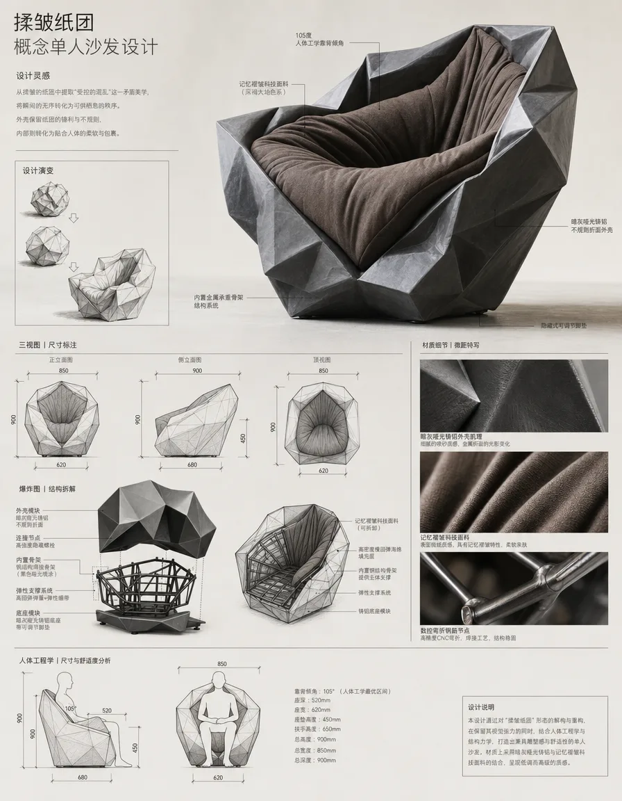

一张排版极度严谨且精美的家具产品设计图解看板（Presentation Board），主题为以"揉皱纸团"为灵感的概念单人沙发设计，采用高端建筑设计的网格排版系统（Grid Layout），在纯净的高级浅燕麦色背景上进行布局。

画面自上而下流畅衔接三大核心内容：上半部分为一个极度写实的 3D 透视主图，展示沙发完美呈现"受控的混乱"几何折面形态，其外部保留了纸团般锋利不规则的几何边缘，内部则转化为贴合人体的平滑凹陷舒适区；左下部分排列着高精度的正交三视图（正立面、侧立面、顶视图）与局部的 3D 等轴测爆炸图，精准拆解展示内部隐藏金属承重骨架与外部壳体的装配关系；右下部分整齐排列几组真实微距照片级的材质特写，包含低饱和度的哑光暗灰铸铝外壳肌理、深沉大地色系的"记忆褶皱"科技面料细节及数控弯折钢筋节点。

整体配色极度克制内敛，大面积呈现低饱和度的高级工业灰、暗沉的大地色系与暗黑哑光金属色，彻底摒弃 CG 渲染感，采用徕卡 M11 相机级别的真实微距胶片摄影质感与清晰的光学景深，利用具有方向性的影棚漫反射光影，深刻凸显"纸团"折面的明暗对比与深邃阴影凹槽。

图文排版极其考究，所有沙发折面节点、剖面图和局部大样旁均强制要求使用带有精致极简细线与线框的准确中文注释（如"暗灰哑光铸铝不规则折面外壳"、"105 度人体工学靠背倾角"），同时在正交三视图和结构节点上，严格按照人体工程学与建筑制图规范，采用带有 45 度短斜线端点的极细尺寸线进行详尽且密集的标注，清晰标明诸如"沙发总宽 850mm"、"坐垫高度 450mm"等关键数据。

画面完美融合工业产品图解的严谨性与大师级材质摄影质感，8K 超高清分辨率。

---

## 26 · 特斯拉品牌视觉识别

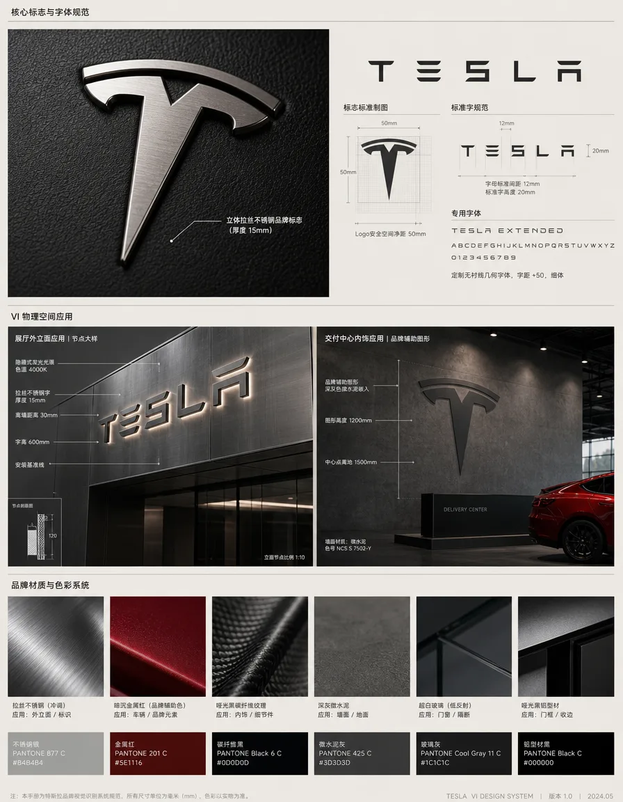

一张排版极度严谨、精美且充满大师水准的品牌视觉识别系统（VI Design）图解看板（Presentation Board），主题为特斯拉（Tesla）的高端品牌视觉规范与材质应用。比例 3:4。采用高端建筑设计的网格排版系统（Grid Layout），在纯净的高级浅燕麦色背景上进行布局。

画面自上而下分为三个核心模块：

顶部（核心标志与字体）：一个极度写实的微距摄影特写，展示立体浮雕工艺的特斯拉"T"型金属 Logo 镶嵌在暗黑哑光环保皮纹理背景上，旁边排列着专属定制的极简无衬线几何字体排版规范示例。

中部（VI 物理空间应用）：两个高精度的立面图结合实景局部摄影，展示 VI 在建筑空间中的应用。左侧为极简的超现代展厅拉丝不锈钢外立面发光字标识节点大样；右侧为工业风交付中心内部暗色微水泥墙面上的品牌辅助图形应用展示。

底部（品牌材质与色彩系统样板）：一组成规则网格排列的真实微距照片级材质与色彩样板特写（如赛博皮卡同款的冷调拉丝不锈钢板、深邃的暗沉金属红烤漆面板、哑光黑高性能碳纤维纹理，以及低饱和度的深灰清水混凝土色块）。

整体配色极度克制内敛，大面积呈现低饱和度的高级工业灰、暗黑哑光金属色与深沉的暗调色彩，彻底摒弃 CG 渲染感，采用徕卡 M11 相机级别的真实微距胶片摄影质感与清晰的光学景深。

核心排版与标注要求：图文排版极其考究，所有标志元素、材质样板和空间应用节点旁均强制要求使用带有精致极简细线与线框的准确中文注释（如"立体拉丝不锈钢品牌标志"、"暗沉金属红品牌辅助色"、"哑光黑碳纤维纹理"、"展厅外立面隐藏式发光字节点"）。同时，在标志规范图和空间应用立面图上，严格按照建筑制图规范，采用带有 45 度短斜线端点的极细尺寸线进行详尽且密集的标注，清晰标明诸如"Logo 安全空间净距 50mm"、"字母标准间距 12mm"、"金属标识厚度 15mm"等关键规范数据。

完美融合品牌设计的严谨逻辑与大师级材质摄影质感，8K 超高清分辨率。

---

## 27 · 吊顶大样图

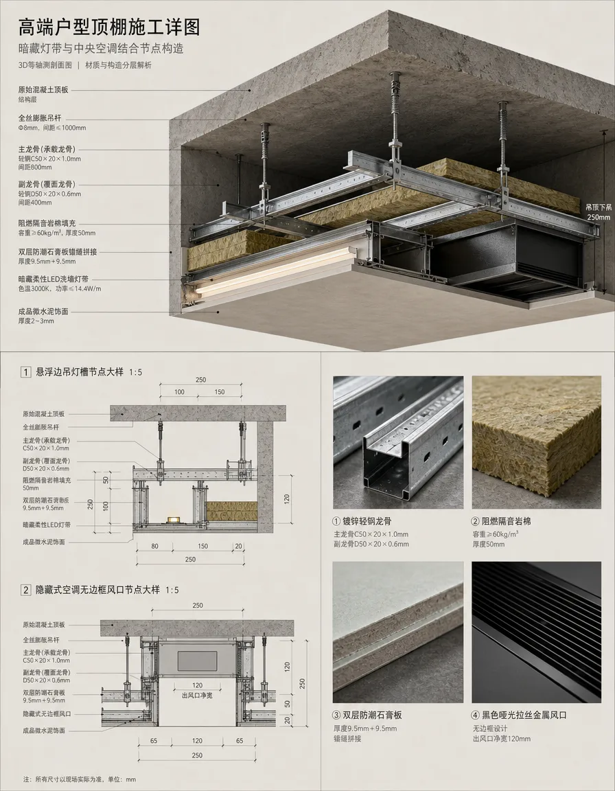

一张排版极度严谨且精美的室内建筑施工图解看板（Presentation Board），主题为高端户型顶棚（吊顶）施工详图与节点大样图 。比例3:4 。采用高端建筑设计的网格排版系统（Grid Layout），在纯净的高级浅燕麦色背景上，将画面从上到下分为三个核心模块 。上半部分主体为一个极度写实的3D等轴测剖面图（Isometric Cutaway），层层剥开展示暗藏灯带与中央空调结合的复杂吊顶内部构造，极其真实地展示从原始顶板、全丝膨胀吊杆、主副镀锌轻钢龙骨、高密度隔音棉，到双层防潮石膏板与最终的哑光微水泥饰面的层级关系 。左下角为两组高精度的2D剖面节点大样图，详细展示了“悬浮边吊灯槽节点”与“隐藏式空调无边框风口节点” 。右下角整齐排列着4个真实微距照片级的材质样板特写（镀锌轻钢龙骨、阻燃隔音岩棉、防潮石膏板剖面、黑色哑光拉丝金属风口） 。整体配色极度克制内敛，大面积呈现低饱和度的高级工业灰、深沉的混凝土色、暗黑哑光金属色与暗沉的大地色系 。核心排版与标注要求：图文排版极其考究，所有结构层级、剖面图和局部大样旁均强制要求使用带有精致极简细线与线框的准确中文注释（如“主龙骨(承载龙骨)”、“双层防潮石膏板错缝拼接”、“阻燃隔音岩棉填充”、“暗藏柔性LED洗墙灯带”） 。同时，在剖面大样图和3D结构图上，严格按照人体工程学与建筑制图规范，采用带有45度短斜线端点的极细尺寸线进行详尽且密集的标注，清晰标明诸如“吊顶下吊高度 250mm”、“灯槽宽度 150mm”、“主龙骨间距 800mm”、“出风口净宽 120mm”等关键数据 。彻底摒弃CG渲染感，采用徕卡M11相机级别的真实微距胶片摄影质感与清晰的光学景深，完美融合工程图解的严谨性，8K超高清分辨率

---

## 28 · 大堂场景漫游分镜图

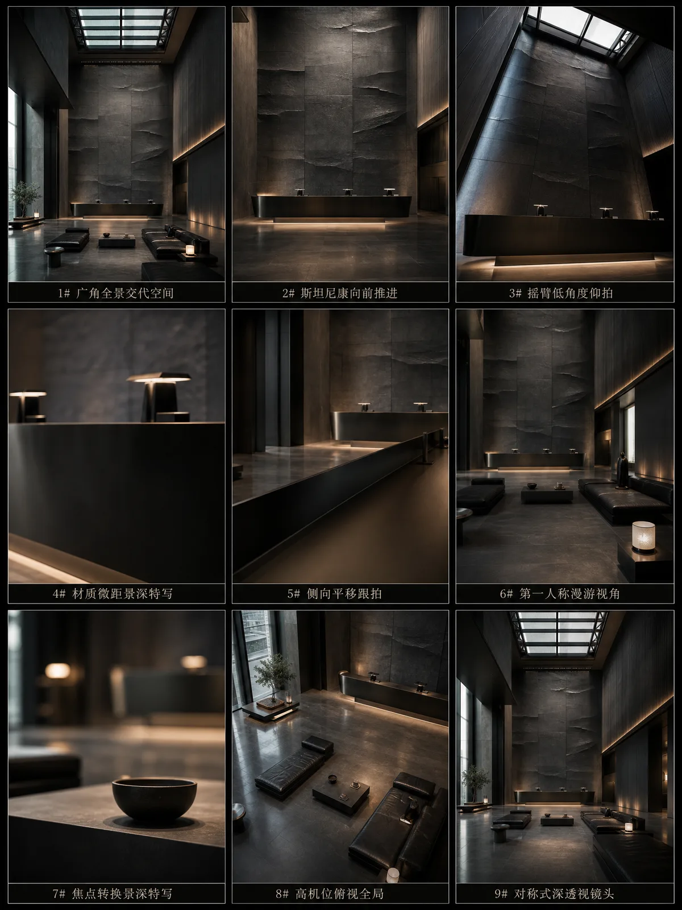

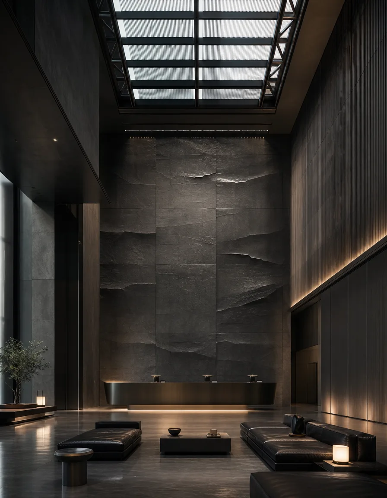

一张排版极度精美且专业严谨的影视级分镜看板（Storyboard Presentation Board） 。比例3:4 。采用高端建筑设计杂志的九宫格平铺排版系统（3x3 Grid Layout），在单张画幅上整齐排列着9个超现代酒店大堂的专业运镜镜头画面 。整体配色极度克制内敛，大面积使用低饱和度的高级灰、深邃的暗黑金属色以及暗沉大地色系的材质 。每个分镜都展现出毫无瑕疵的真实照片质感（Photorealistic），采用徕卡相机与不同焦段镜头拍摄，彻底摒弃传统CG渲染感 。画面展示了极简悬浮式暗黑接待台与参数化深灰石墙的9个动态瞬间：广角大远景（Establishing Shot）、斯坦尼康缓慢推进（Dolly In）、摇臂低角度仰拍（Low Angle Tilt Up）、接待台局部微距特写（Macro Detail）、侧向平移跟拍（Tracking Shot）、第一人称漫游视角（POV Walkthrough）、焦点转换景深特写（Rack Focus）、高机位俯视（High Angle）以及对称式深透视镜头 。核心排版与标注要求：图文排版极其考究，每一个分镜画面下方都有对应的极简细线边框 。在每一个细线边框里面，强制要求用高级排版字体写出准确的中文运镜注释（如“1# 广角全景交代空间”、“2# 斯坦尼康向前推进”、“4# 材质微距景深特写”） 。完美融合顶级影视分镜逻辑与大师级建筑空间实景摄影质感，8K超高清分辨率

---

## 29 · 小蛮腰知识分解图

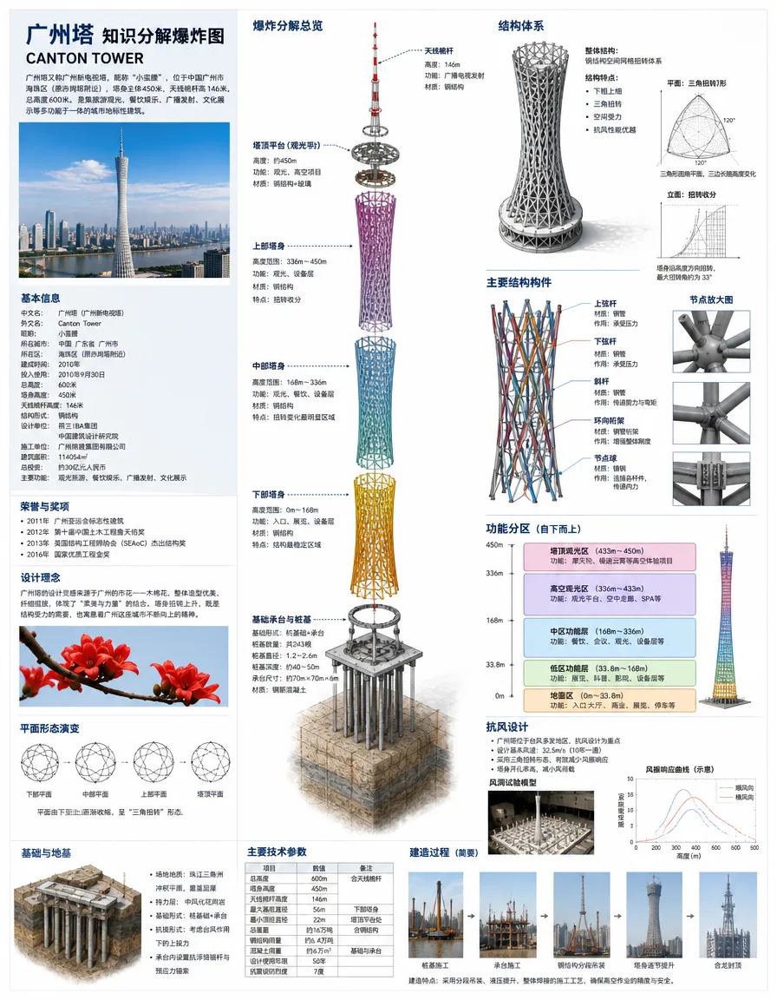

排版极其严谨且精美的高端建筑工程信息图表（Infographic Presentation Board），主题为地标建筑“广州塔”（Canton Tower）的结构知识分解。采用纯净的高级浅燕麦色背景与极其考究的网格排版系统（Grid Layout），将庞大的信息有逻辑地分布在画面中。

画面正中央是核心视觉焦点：一个极度写实的3D等轴测爆炸图（Exploded View），将广州塔沿垂直方向极其精准地拆解为天线桅杆、塔顶平台、上部塔身、中部塔身、下部塔身以及底部的基础承台与桩基。画面左侧自上而下规则排列着：基础信息模块、设计理念意向图（一朵极具写实感但色调克制的木棉花）、展示由圆到三角渐变的平面形态演变线稿，以及一个局部的3D地基剖面详图。画面右侧排列着：塔身整体钢结构网格体系图、带有真实微距胶片摄影质感的钢管节点放大特写、功能分区立面图以及抗风设计风洞试验数据图表。底部横向排列着技术参数图表与5至6张按时间顺序排列的真实工程摄影图（展示从桩基施工到合龙封顶的建造过程）。

整体配色极度克制内敛，大面积使用低饱和度的高级工业灰、暗黑哑光拉丝金属色（用于展示钢结构构件）以及深沉的大地混凝土色系。核心排版与标注要求：图文排版极其考究，所有模块、3D分解层级结构与局部细节均强制要求使用带有精致极简细线与线框的准确中文注释（如“上部塔身”、“环向桁架”、“基础承台”等）。同时，在立面图和剖面图上严格按照人体工程学与建筑制图规范，采用带有45度短斜线端点的极细尺寸线进行详尽标注，清晰标明诸如“总高度 600m”、“塔身高度 450m”、“中区功能层 168m~336m”等关键高程数据。完美融合顶级结构工程图解的严谨逻辑与真实的材质摄影质感，8K超高清分辨率

---

## 30 · 地面硬化施工工艺

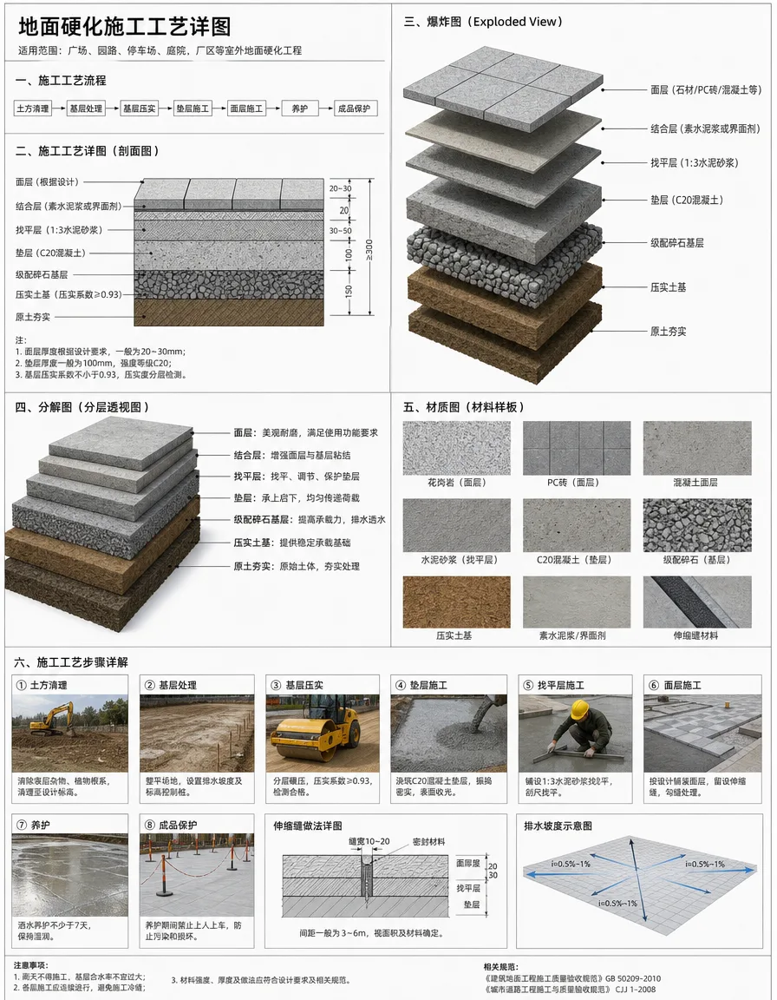

一张排版极其严谨且精美的建筑工程信息图表（Infographic Presentation Board），主题为“地面硬化施工工艺详图”。采用纯白背景与高端建筑设计的网格排版系统（Grid Layout），将画面有逻辑地分为六个清晰的核心模块。左上角为带有极简细线框的阶段式施工工艺流程节点图；左侧中部为2D剖面详图，右上方为极具立体感的3D等轴测爆炸图（Exploded View），左下方为3D分层透视图。这三个核心结构图均极度写实地展示了七层内部构造：面层、结合层、找平层、垫层、级配碎石基层、压实土基与原土夯实。右侧中部排列着8个真实照片级的材质样板特写（包含花岗岩、PC砖、混凝土、水洗砂浆、级配碎石等）；底部则整齐排列着8个包含真实工程机械（如黄色压路机、履带挖掘机）与工人的施工步骤实景摄影图，并附带伸缩缝剖面和排水坡度（i=0.5%-1%）的细节图解。整体配色极其克制内敛，大面积呈现低饱和度的高级工业灰、深沉的混凝土色与暗沉的大地夯土色系。核心排版要求：图文排版极其考究，所有模块和层级均强制要求使用带有精致细线与线框的准确中文注释，并在剖面图上严格按照人体工程学与建筑制图规范，采用带有45度短斜线端点的极细尺寸线进行详尽的垂直厚度标注（如 20-30, 30-50, 100, 150 等数据）。完美融合顶级工程图解的严谨性与真实的胶片材质摄影质感，图文并茂，8K超高清分辨率

---

## 31 · 石膏线条展示图

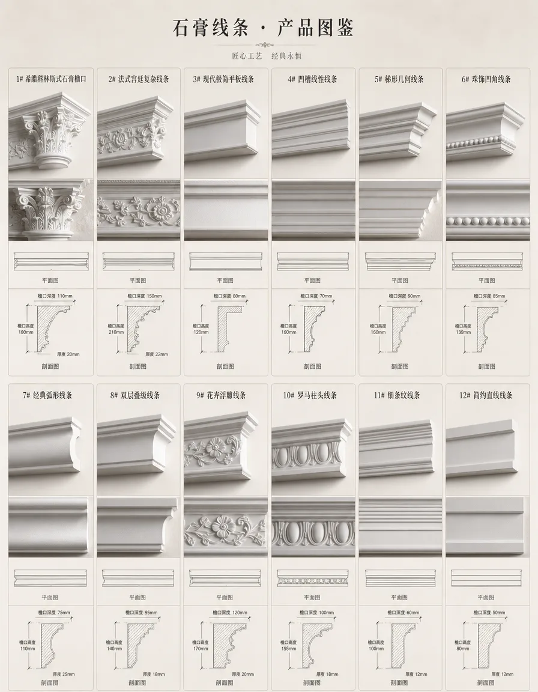

排版极度精美内敛的室内装修石膏线条（Gypsum Mouldings）产品图鉴展示看板。比例16:9。采用高端建筑设计杂志的网格平铺排版系统（Grid Layout），整齐排列着12个完全不同款式的逼真石膏线条样块（6个一组，分两排展示）。每个样块下方都包含了一个对应的真实照片级1:1样块摄影（Photorealistic Sample）、一个详细的平面图（Plan View）和一个详尽的剖面图（Section View）。样块采用柔和明亮的影棚均匀漫反射光照，清晰展现出白色石膏表面的粉状、哑光肌理与细腻质感。在高级的低饱和度浅燕麦色纯净背景上，核心排版要求：图文排版极其考究，每一个样块、平面图和剖面图下方都有对应的极简细线边框。在每一个细线边框里面，强制要求用高级的排版字体写出准确的中文材质描述和图解：对12种不同款式进行编号描述，例如“1# 希腊科林斯式石膏檐口”、“2# 法式宫廷复杂线条”、“3# 现代极简平板线条”、“4# 凹槽线性线条”、“5# 梯形几何线条”、“6# 珠饰凹角线条”等（直到12号）。在对应的平面和剖面图下方，标明“平面图”和“剖面图”。同时，在每个剖面图上，严格按照人体工程学和建筑制图标准，采用带有45度短斜线端点的极细尺寸线进行详尽的标注，清晰标明诸如“檐口高度 180mm”、“檐口深度 110mm”、“厚度 15mm”等关键数据。整体视觉干净、沉稳且专业，极具国际专业感。8K分辨率，大师级建筑材质摄影，真实光学摄影质感

---

## 32 · 装修木饰面板

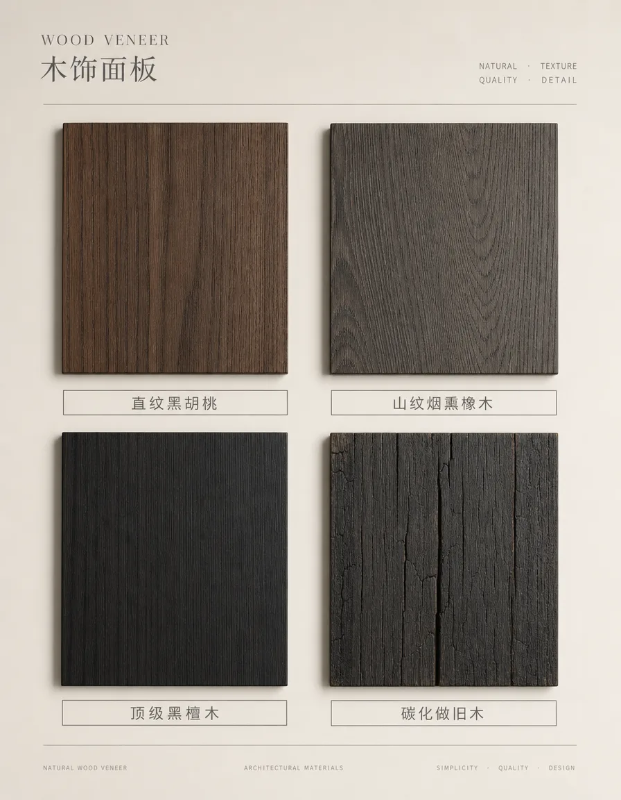

一张排版极度精美内敛的室内装修木饰面板（Wood Veneer）产品图鉴展示看板 。比例3:4 。采用高端建筑设计杂志的网格平铺排版系统（Grid Layout） 。在高级且低饱和度的浅燕麦色纯净背景上 ，整齐排列着一系列逼真的木饰面样块 。展示了丰富且克制的纹理款式：直纹黑胡桃木、山纹烟熏橡木、深邃黑檀木以及做旧碳化木 。采用柔和明亮的影棚均匀漫反射光照，清晰展现木材表面的天然导管、凹凸肌理与细腻的高级哑光质感 。核心排版要求：图文排版极其考究，每一块木饰面板下方都有对应的极简细线边框 。在每一个细线边框里面，强制要求用高级的排版字体写出准确的中文材质描述：“直纹黑胡桃”、“山纹烟熏橡木”、“顶级黑檀木”、“碳化做旧木” 。整体视觉干净、通透且沉稳，极具国际专业感 。8K分辨率，大师级建筑材质摄影

---

## 33 · 购物中心可行性分析图

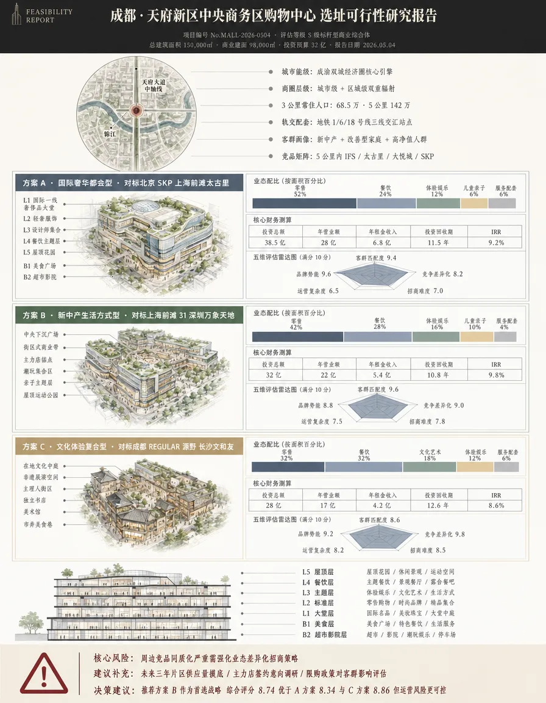

大型购物中心选址可行性分析报告图 · 生成提示词

一、整体设定
- **画面类型**：一张专业的大型购物中心选址可行性分析报告图
- **构图比例**：整体画面比例严格 3:4 竖版构图
- **视觉风格**：对标麦肯锡 / BCG / 贝恩 / 世邦魏理仕 / 戴德梁行国际顶级地产咨询公司年度战略报告排版美学
- **整体配色**：极度低调内敛，采用米白底色配深炭灰主文字，莫兰迪灰蓝、雾霾绿、暖砂米、深酒红作为业态分级色块；严禁出现高饱和鲜艳色
- **文字规范**：所有标注全部中文，严禁英文字符；字体统一使用思源黑体配长仿宋体数字

---

二、画面分区（自上而下）

① 顶部横幅区（约 9% 高度）
- 深炭灰底、高级米白字横幅
- 左上角放置极简衬线 **"FEASIBILITY REPORT"** 水印图形
- 居中显示标题：**"成都·天府新区中央商务区购物中心 选址可行性研究报告"**
- 下方两行极细灰字：
  1. "项目编号 No.MALL-2026-0504 · 评估等级 S 级标杆型商业综合体"
  2. "总建筑面积 150,000㎡ · 商业建面 98,000㎡ · 投资预算 32 亿 · 报告日期 2026.05.04"

  ② 宏观区位画像区（约 15% 高度）
- 暖米色底
- **左侧**：圆形抽象城市俯视区位示意图，标注天府大道中轴线与锦江交汇核心枢纽
- **右侧**：用极细实线加 1.5mm 莫兰迪灰圆点端头引线，工整列出六条核心数据：
  1. 城市能级：成渝双城经济圈核心引擎
  2. 商圈层级：城市级 + 区域级双重辐射
  3. 3 公里常住人口：68.5 万 · 5 公里 142 万
  4. 轨交配套：地铁 1/6/18 号线三线交汇站点
  5. 客群画像：新中产 + 改善型家庭 + 高净值人群
  6. 竞品矩阵：5 公里内 IFS / 太古里 / 大悦城 / SKP

  ③ 业态组合推荐核心区（约 53% 高度）
  采用垂直三段式横向卡片堆叠，每段代表一种商业定位策略。

  方案 A
- **顶部色条**：莫兰迪灰蓝色窄边色条配白字 **"方案 A · 国际奢华都会型 · 对标北京 SKP 上海前滩太古里"**
- **左侧 38% 区域**：手绘风格俯视 30° 等轴测购物中心体量缩略图，淡雅水彩质感，标注：
  - "L1 国际一线奢侈品大堂"｜"L2 轻奢服饰"｜"L3 设计师集合"｜"L4 餐饮主题层"｜"L5 屋顶花园"｜"B1 美食广场"｜"B2 超市影院"
- **右侧 62% 区域**：分上下两栏
  - **上栏｜业态配比堆叠条形图**（按面积百分比）：零售 52% / 餐饮 24% / 体验娱乐 12% / 儿童亲子 6% / 服务配套 6%
  - **中栏｜核心财务测算极简表格**：投资总额 38.5 亿 / 年营业额 28 亿 / 年租金收入 6.8 亿 / 投资回收期 11.5 年 / IRR 9.2%
  - **下栏｜五维评估雷达图**：客群匹配度 9.4 · 竞争差异化 8.2 · 招商难度 7.0 · 运营复杂度 6.5 · 品牌势能 9.6

  方案 B
- **顶部色条**：雾霾绿色窄边色条配白字 **"方案 B · 新中产生活方式型 · 对标上海前滩 31 深圳万象天地"**
- **左侧轴测缩略图**标注：
  - "中央下沉广场"｜"街区式商业带"｜"主力店锚点"｜"潮玩集合区"｜"亲子主题层"｜"屋顶运动公园"
- **右侧**：
  - **上栏｜业态配比**：零售 42% / 餐饮 28% / 体验娱乐 16% / 儿童亲子 10% / 服务配套 4%
  - **中栏｜财务**：投资总额 32 亿 / 年营业额 22 亿 / 年租金收入 5.4 亿 / 投资回收期 10.8 年 / IRR 9.8%
  - **下栏｜雷达图**：客群匹配度 9.6 · 竞争差异化 9.0 · 招商难度 7.8 · 运营复杂度 7.5 · 品牌势能 8.8

  方案 C
- **顶部色条**：暖砂米色窄边色条配白字 **"方案 C · 文化体验复合型 · 对标成都 REGULAR 源野 长沙文和友"**
- **左侧轴测缩略图**标注：
  - "在地文化中庭"｜"非遗展演空间"｜"主理人街区"｜"独立书店"｜"美术馆"｜"市井美食巷"
- **右侧**：
  - **上栏｜业态配比**：零售 32% / 餐饮 32% / 文化艺术 18% / 体验娱乐 12% / 服务配套 6%
  - **中栏｜财务**：投资总额 28 亿 / 年营业额 17 亿 / 年租金收入 4.2 亿 / 投资回收期 12.6 年 / IRR 8.6%
  - **下栏｜雷达图**：客群匹配度 8.6 · 竞争差异化 9.8 · 招商难度 8.5 · 运营复杂度 8.2 · 品牌势能 9.2

  ④ 空间体量与楼层规划区（约 12% 高度）
- 白底
- 横向剖面示意图：展示购物中心五层主体加两层地下结构，每层用细实线水平分隔
- 标注楼层功能：
  - "L5 屋顶层"｜"L4 餐饮层"｜"L3 主题层"｜"L2 标准层"｜"L1 大堂层"｜"B1 美食层"｜"B2 超市影院层"

  ⑤ 风险与建议区（画面底部，约 11% 高度）
- 浅米黄底，配深酒红 **"⚠"** 极简图标
- 图标右侧三行风险与建议正文：
  1. "核心风险：周边竞品同质化严重需强化业态差异化招商策略"
  2. "建议补充：未来三年片区供应量摸底 / 主力店签约意向调研 / 限购政策对客群影响评估"
  3. "决策建议：推荐方案 B 作为首选战略 综合评分 8.74 优于 A 方案 8.34 与 C 方案 8.86 但运营风险更可控"

---

三、全局制图规范
- 所有引线为细实线加 1.5mm 莫兰迪灰实心圆点端头，**绝对禁止箭头**
- 所有中文文字必须清晰锐利不糊
- 整张图整体留白充足，排版极度克制，讲究负空间美学
- 整张图比例严格 3:4 竖版

---

## 34 · 奢华低调的现代休息区

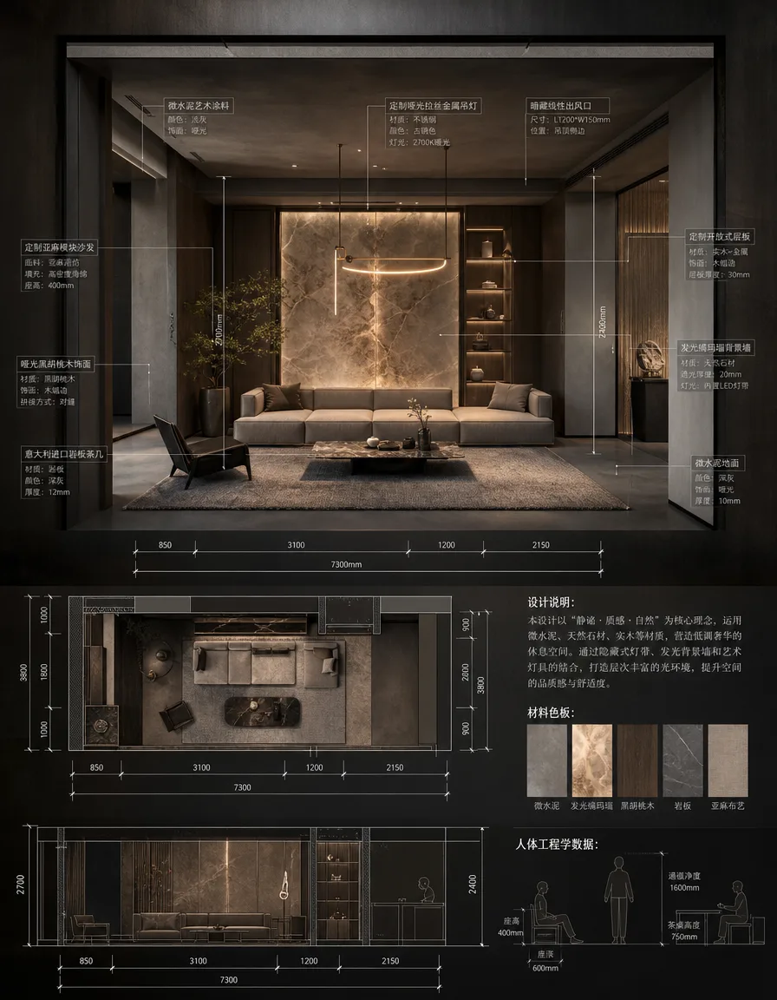

一张极具高级感和国际水准的室内设计排版图（Presentation Board），采用平滑过渡的无缝拼接构图，将硬装主材与软装搭配完美融合在同一画幅中。画面左侧重点展现空间的核心主材特写，大面积使用低饱和度的哑光微水泥与暗沉色调的高级深色原木材质；画面向右侧自然且流畅地过渡为一个布置完善、克制且高级的室内休息区。空间内的软装元素一键配齐，整体配色严格遵循低调内敛的原则：视觉中心是一组高级灰调的亚麻质感模块化落地沙发，上方悬挂着一盏极简的暗黑色拉丝金属几何线性吊灯；沙发后方的背景墙上点缀着一幅深色大地色系的抽象肌理艺术挂画，角落里放置着一盆姿态优雅、绿意深邃的室内大型阔叶绿植。整体光影柔和且克制，局部采用柔和的漫反射光，阴影层次丰富，呈现出高级的电影级质感与极强的艺术张力，虚幻引擎5渲染标准，大师级室内摄影风格，8K超高清分辨率

---

## 35 · 会所线稿-彩平-意向

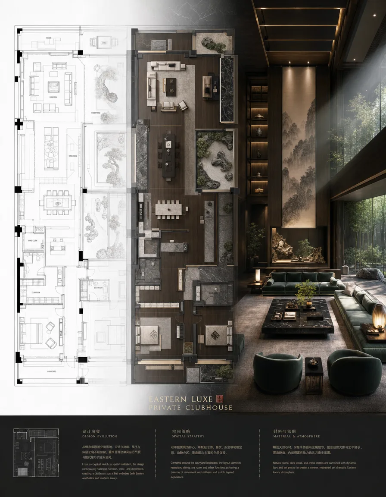

一张具有极高国际水准的建筑设计排版图（Presentation Board），采用从左至右的三拼图（Triptych）无缝过渡构图，展示一个现代东方奢华风格私人会所的完整设计演变过程。画面的最左侧是清晰专业的CAD黑白室内线稿，展现精确的空间布局与家具结构线条；画面的中间部分平滑过渡为具有丰富材质细节的彩色顶视平面图，呈现出深色高级胡桃木地板、室内微缩枯山水景观与天然大理石的纹理及柔和阴影；画面的最右侧完美演变为一张极度逼真写实、极具艺术张力的人视角3D室内氛围效果图，展示挑高天花板下的主会客区，精致的丝绒组合沙发，黑檀木茶桌，窗外透出的静谧竹林景观，以及高级的隐藏式照明和戏剧性的丁达尔光影效果。整张图片排版充满高级感，三个阶段在同一画布上过渡流畅、逻辑清晰，电影级质感，大师级建筑摄影光影，虚幻引擎5渲染标准，8K超高清分辨率

---

## 36 · 面包店展柜信息图

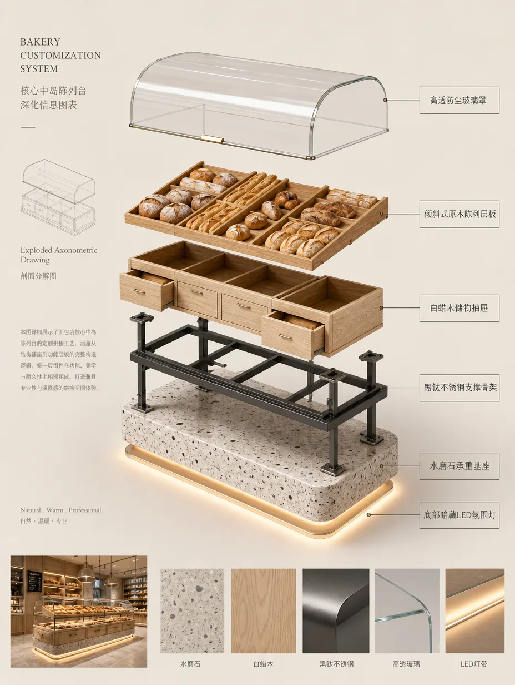

专业学术氛围的面包店展柜深化信息图表。采用3D等轴测视角的剖面分解图（爆炸图），精准展示面包店“核心中岛陈列台”的定制拼接工艺。画面结构从下至上悬浮展开：最底层是带有细腻颗粒感的水磨石承重底座、隐蔽的踢脚线暖色LED灯带、黑钛不锈钢支撑骨架、带有实木质感的白蜡木储物抽屉层、倾斜设计的天然原木面包陈列隔板，以及最顶部的极简弧形高透防尘玻璃罩。核心排版要求：采用顶级建筑杂志内页的排版美学，大面积浅燕麦色高级留白。各个构件旁延伸出极简的深灰色引出线，连接着规范的细线边框。在细线边框内部，强制要求用排版字体清晰写出准确的中文标注：“水磨石承重基座”、“底部暗藏LED氛围灯”、“白蜡木储物抽屉”、“倾斜式原木陈列层板”、“高透防尘玻璃罩”。 整体呈现出极其严谨的结构美学与温暖治愈的烘焙空间氛围，8K超高清材质渲染。极具国际高级感。

---

## 37 · 五星级酒店客房给排水示意图

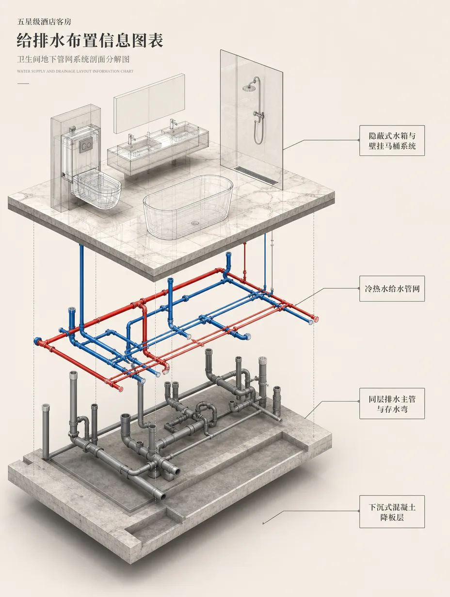

国际高级感与专业学术氛围的五星级酒店客房给排水布置信息图表。采用3D等距视角的剖面分解图（爆炸图），精准展示酒店卫生间的地下管网逻辑。画面从下至上悬浮展开：最底层是下沉式混凝土楼板（降板结构）、复杂的灰色PVC同层排水主管道与存水弯系统；中间层是纵横交错的红色（热水）与蓝色（冷水）PPR给水管网；最上层是铺设着高级大理石的卫生间地面，上面配有透明线框质感的壁挂式马桶、双台盆洗手台、独立浴缸和淋浴区线性地漏。核心排版要求：采用顶级建筑杂志内页的排版美学，大面积浅燕麦色高级留白。各个管网结构层旁延伸出极简的深灰色引出线，连接着规范的细线边框。在细线边框内部，强制要求用排版字体清晰写出准确的中文标注：“下沉式混凝土降板层”、“同层排水主管与存水弯”、“冷热水给水管网”、“隐蔽式水箱与壁挂马桶系统”。 整体呈现出极其严谨的工程逻辑与极简的静态奢华感，8K超高清管线渲染.

---

## 38 · 水疗会所设计展板

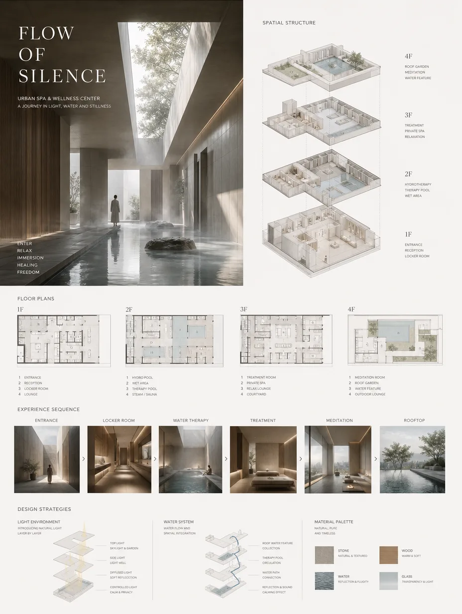

现代四层水疗空间（Wellness Spa）设计展示板 · 生成提示词

国际顶级建筑事务所风格的"现代四层水疗空间（Wellness Spa）"设计展示板（Architectural Presentation Board），整体风格极简、克制、具有高级品牌感与空间叙事。

一、项目设定
- **类型**：城市高端水疗中心 / Wellness Spa
- **建筑**：四层垂直空间（4 Floors）
- **核心概念**：光、水、静谧、疗愈、流动
- **用户体验**：从城市进入 → 减压 → 沉浸 → 深度放松 → 觉醒

二、整体排版（关键）

- 严格瑞士网格系统（grid layout）
- 大量留白（white space），呼吸感强
- 杂志级排版（editorial design）
- 信息分级清晰（标题 / 模块 / 注释）
- 模块对齐精准、边距统一
- 版面干净，无冗余元素

三、画面结构

1. 主视觉（Hero Image，占比约 35%）
- 超写实水疗空间（室内或半室外）
- 水面反射 + 柔和自然光（顶部天光 / 光井）
- 材质：石材、微水泥、木材、雾气
- 氛围：安静、禅意、电影感（cinematic lighting）
- 有人物剪影（增强尺度与氛围）

2. 四层功能结构（核心亮点）
- 轴测爆炸图（Axonometric Exploded View）
- 清晰展示四层逻辑：
  - **B1 / L1**：接待、更衣、初级放松
  - **L2**：水疗池、理疗区（湿区）
  - **L3**：按摩、冥想、私密空间
  - **L4**：屋顶花园、冥想、水景
- 线稿 + 淡色填充 + 极简标注

3. 平面系统（Plans）
- 每层小平面（统一风格）
- 浅灰线条 + 低饱和填色
- 标注克制（英文为主）

4. 空间体验（底部横排）
- 按动线展示：入口 → 更衣 → 水疗池 → 按摩 → 冥想 → 屋顶
- 统一色调（暖灰 + 木色 + 水色）
- 构图干净，光影柔和

5. 设计策略（小模块）
- 光环境（Light Strategy）
- 水系统（Water Flow）
- 材料（Material Palette）
- 用极简图标 + 短句表达

四、视觉风格

- **色彩**：米白、暖灰、深灰、木色、水蓝（低饱和）
- **光影**：柔光、漫反射、自然光、雾气
- **材质**：真实但不过锐（no over-sharpen）
- **质感**：高级酒店 / 奢侈品牌感（Aman / MUJI / Apple 风格融合）

五、高级关键词（一定要加）
极简主义、瑞士排版、建筑竞赛板、editorial layout、luxury wellness design、zen atmosphere、spa architecture、soft shadow、natural light、grid system、high-end branding、calm and peaceful

六、负面约束
避免：信息堆砌、颜色杂乱、地产广告风、廉价 UI 图标、过度对比、低级渲染、脏乱背景

七、画面参数
`--ar 3:4` --高清、超精细、8K、print-read

---

## 39 · 酒店材料情绪板

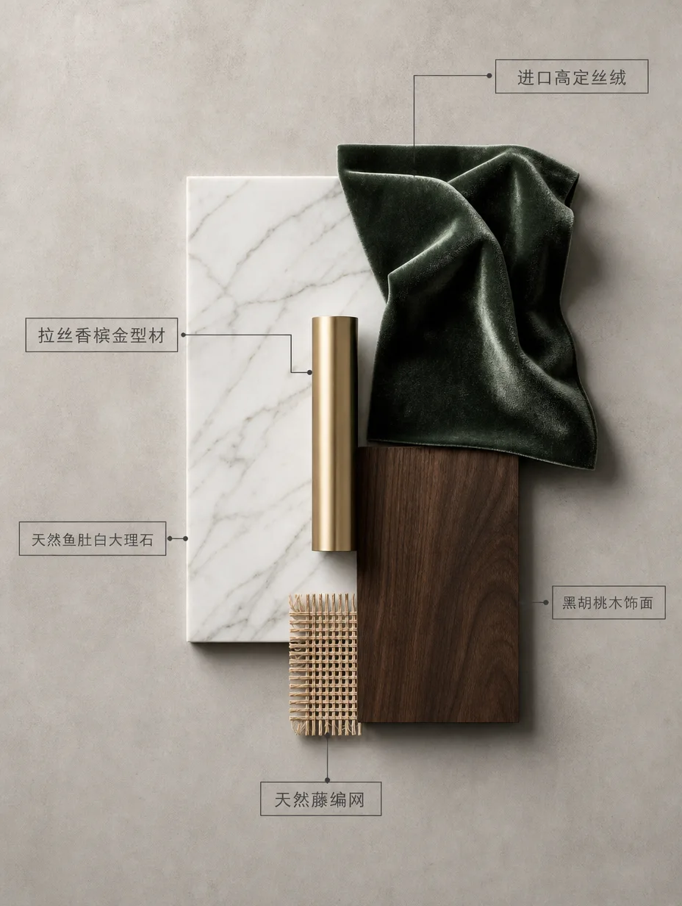

现代时尚感与轻奢度假风的酒店软装情绪板（Mood Board）。比例3:4。采用顶级高端家居杂志的俯视平铺摄影风格（Top-down flatlay）。在高级的暖灰色哑光微水泥背景上，精心且错落有致地层叠排列着精美的软装与主材小样。材质组合： 一块呈现自然流纹的鱼肚白大理石板、一块柔软且带有高级光泽的墨绿色进口丝绒布料、一截精致的拉丝香槟金金属管、一块深邃的黑胡桃木饰面板，以及局部点缀的一小块天然编织藤网（体现度假感）。核心排版要求： 采用大面积克制留白，排版精美内敛。各个材质样块边缘延伸出极简的深灰色引出线，连接着极简的细线边框。在细线边框内部，强制要求用排版字体清晰写出准确的中文材质描述：“进口高定丝绒”、“拉丝香槟金型材”、“天然鱼肚白大理石”、“黑胡桃木饰面”、“天然藤编网”。 柔和的影棚自然漫反射光，材质纹理极具触感，8K超高清逼真渲染。

---

## 40 · 私人庭院鸟瞰图

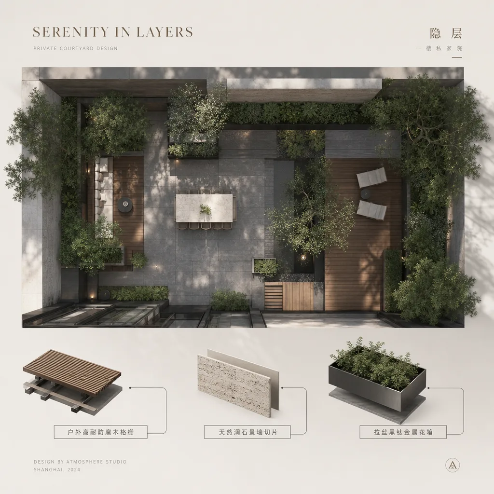

内敛奢华感的一楼私家庭院综合展示看板。采用顶级生活方式杂志（如KINFOLK）的排版美学。画面视觉中心是一幅极具静谧氛围的庭院正俯视鸟瞰图（Top-down aerial view），完美展现了几何空间的切割、木质地台与高级灰石材的穿插，以及郁郁葱葱的低饱和度绿植。而在鸟瞰图的下方边缘，极其精致地网格化悬浮排布着该庭院核心材质的物理大样爆炸分解图。核心排版要求：整体配色采用低饱和度的大地色、灰绿色和高级灰，大面积留白。各个物理材质样板旁延伸出极简的深灰色引出线，连接着规范的细线边框。在细线边框内部，强制要求用排版字体清晰写出准确的中文标注：“户外高耐防腐木格栅”、“天然洞石景墙切片”、“拉丝黑钛金属花箱”。 低饱和度调色盘，光影斑驳且具有呼吸感，完美融合自然与现代建筑，8K顶级景观汇报表现图。国际庭院设计大师获奖作品比例3:4

---

## 41 · 断桥铝窗工艺标准

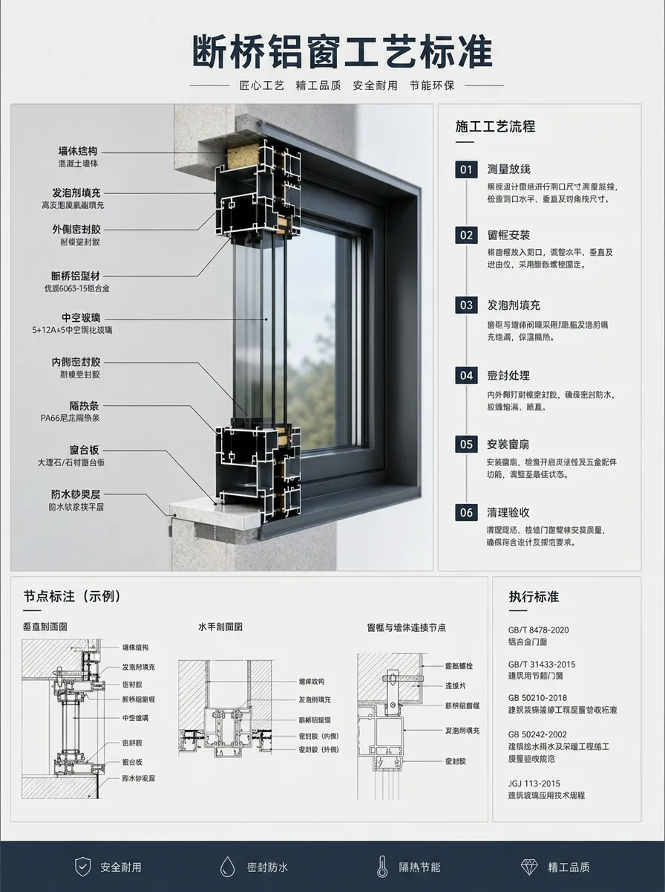

断桥铝窗施工工艺和标注及标准，中文引线标注，简洁时尚大气内敛风格

---

## 42 · 球形网架结构工艺图

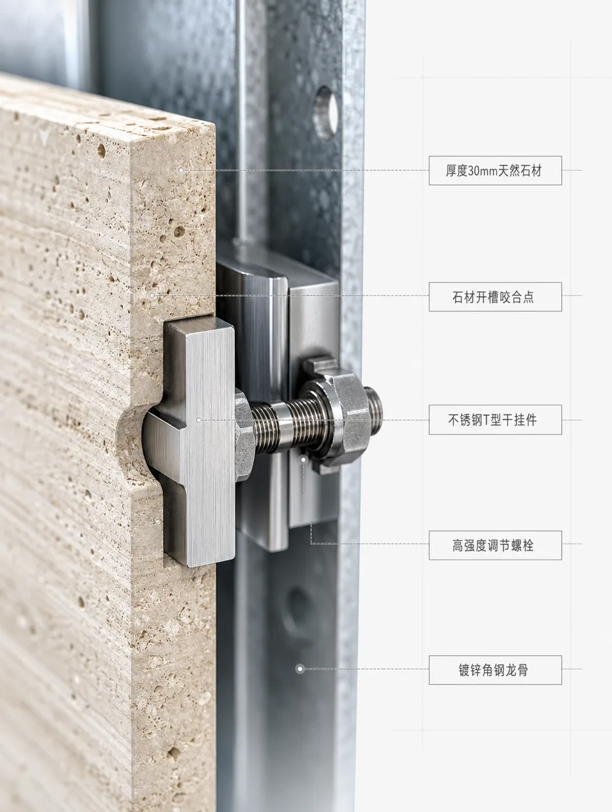

高端建筑幕墙干挂节点局部特写信息图表。采用微距摄影级别的3D剖透视视角，放大展示不锈钢挂件与石材开槽处的咬合工艺大样。画面极致聚焦：厚重的天然洞石面板侧边开有精准的半月形短槽，高光拉丝质感的不锈钢T型（或蝴蝶型）挂件紧紧卡咬在石材槽内，挂件后方通过高强度不锈钢螺栓与厚重的镀锌角钢龙骨牢固连接。核心排版要求：画面右侧进行大面积极度克制的留白，带有极细的工程排版对齐线和细线文本边框。在细线边框的内部，强制要求必须清晰地写有具体的中文节点描述：“厚度30mm天然石材”、“石材开槽咬合点”、“不锈钢T型干挂件”、“高强度调节螺栓”、“镀锌角钢龙骨”。 充满机械与结构的极致理性美学，光影干净犀利，展现出极高的造价感，8K精细材质渲染。非常多的细节，极度精密。

---

## 43 · 铝板幕墙干挂工艺

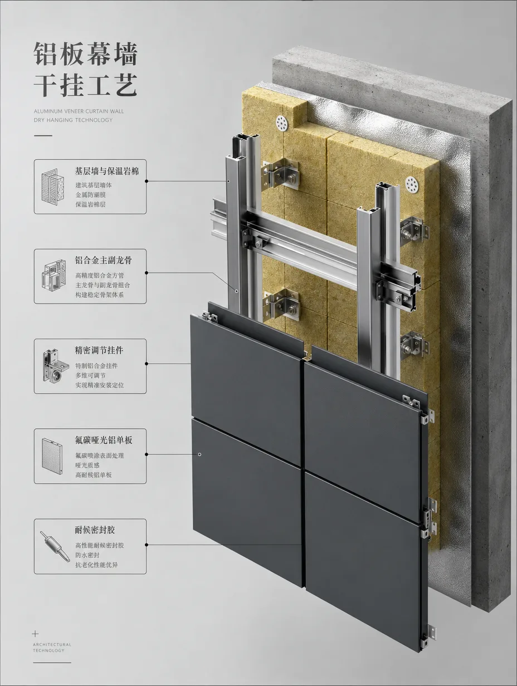

一张极具现代科技感与严谨工程美学的建筑施工工艺信息图表。采用3D等距视角的剖面分解图（爆炸图），精准展示铝板幕墙干挂工艺。画面结构层依次悬浮剥离：建筑基层墙体、带有金属防潮膜的黄色保温岩棉层、高精度的铝合金方管主龙骨与副龙骨骨架、特制的铝合金调节挂件，以及最外层的氟碳喷涂深灰色哑光铝单板，板缝之间带有黑色的耐候密封胶细节。核心排版要求：整体为低饱和度的静奢风配色，背景为高冷的浅灰质感底色。各个结构部件旁延伸出极细的引出线，连接着极简的细线边框。在细线边框内部，必须清晰排布以下中文工艺标注文字：“基层墙与保温岩棉”、“铝合金主副龙骨”、“精密调节挂件”、“氟碳哑光铝单板”、“耐候密封胶”。 图文排版极其考究，呈现出画廊级艺术展板的视觉冲击力，8K级别精细渲染。

---

## 44 · 玻璃砖·光影的艺术

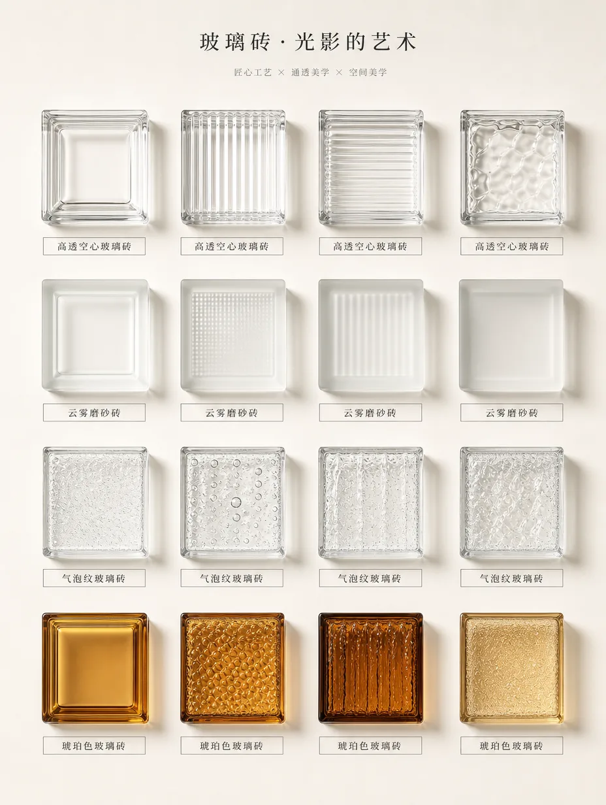

一张排版极度精美内敛的室内装修玻璃砖产品图鉴展示看板。比例3:4。采用高端设计杂志的网格平铺排版系统（Grid Layout）。在高级浅燕麦色的纯净背景上，整齐排列着一系列逼真的玻璃砖样块。展示了丰富的款式：透明空心砖、云雾磨砂砖、气泡纹砖以及琥珀色砖。采用柔和明亮的影棚均匀漫反射光照，清晰展现表面凹凸肌理与厚重感。核心排版要求：图文排版极其考究，每一块玻璃砖下方都有对应的极简细线边框。在每一个细线边框里面，强制要求用排版字体写出准确的中文材质描述：“高透空心玻璃砖”、“云雾磨砂砖”、“气泡纹玻璃砖”、“琥珀色玻璃砖”。 整体视觉干净、通透，极具国际专业感。8K分辨率，顶级建筑材质摄影。

---

## 45 · 别墅设计方案展示

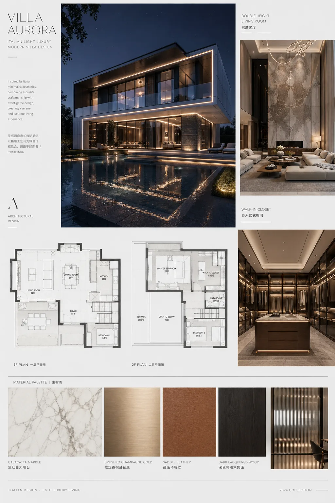

一张代表国际顶级意式轻奢风格的二层现代别墅设计展示板。排版具有极强的时尚先锋感和几何分割美学，宛如高端奢侈品画册。主体为一张极具视觉冲击力的别墅夜景外观图（大面积通透的烟熏玻璃与发光结构）；清晰高级的家具布置平面图平铺于中。右侧展示奢华的室内空间（挑高起居室、衣帽间），体现出昂贵的材质光泽。下方精心阵列着主材样板：大面积流纹的鱼肚白大理石、拉丝香槟金金属、高级马鞍皮和深色烤漆木面板。背景为冷峻的浅灰白色。极简细线排版，国际范十足，8K逼真渲染

---

## 46 · 主材展示等距展台风

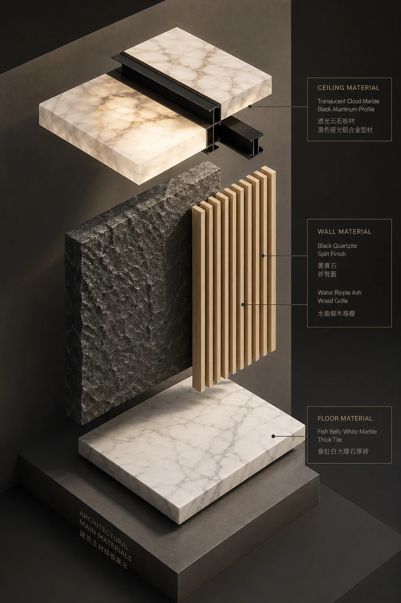

一张极具空间立体感的室内主材样板展示图，采用3D等距视角（Isometric view）的博物馆展台陈列风格。在一个极简的高级灰磨砂石膏基底上，立体地悬浮并陈列着精美的建筑主材小样。**顶棚主材：**半透明的透光云石板材与黑色哑光铝合金型材穿插配合；**墙面主材：**一块带有粗犷斧劈纹理的黑青石板，紧挨着温润的浅色水曲柳木格栅模型；**地面主材：**最底层稳稳放置着具有高级光泽的鱼肚白大理石厚砖。这些材质样板如同昂贵的艺术雕塑般呈现，侧面带有精准的厚度与物理切割质感。极简的深色指示线从各材质引出，连接着优雅的标注框。采用博物馆级的精准聚光灯照明，光影深邃，呈现出低调内敛的高定奢华感，8K建筑级渲染。

---

## 47 · 内敛的主材展板

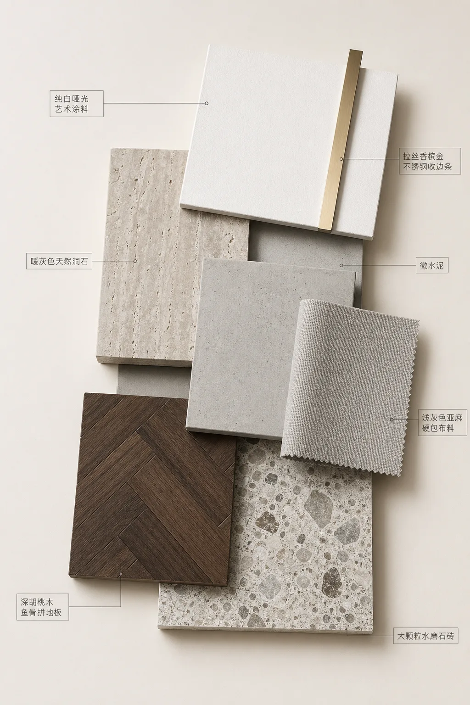

一张极具高级感与专业审美的主材样板展示图（Material Mood Board），采用俯视平铺的顶级建筑杂志摄影排版风格。画面中精心且错落有致地层叠排列着各类室内真实物理材质样块。**顶棚材料展示区：**放置着纯白哑光艺术涂料样板与极细的拉丝香槟金不锈钢收边条；**墙面材料展示区：**包含一块暖灰色的天然洞石（Travertine）切片、带有细微颗粒感的微水泥样块，以及一片柔软的浅灰色亚麻硬包布料；**地面材料展示区：**陈列着深邃的胡桃木鱼骨拼地板小样与一块大颗粒的高级水磨石砖。各个样块相互叠压，边缘带有极细的深灰色引出线，连接着极简的中文文字标注框。整体为低饱和度的静奢风配色，浅燕麦色背景，大面积克制留白。柔和的影棚自然漫反射光，材质纹理极具触感，8K超高清逼真渲染。

---

## 48 · 极简暗藏发光踢脚线工艺

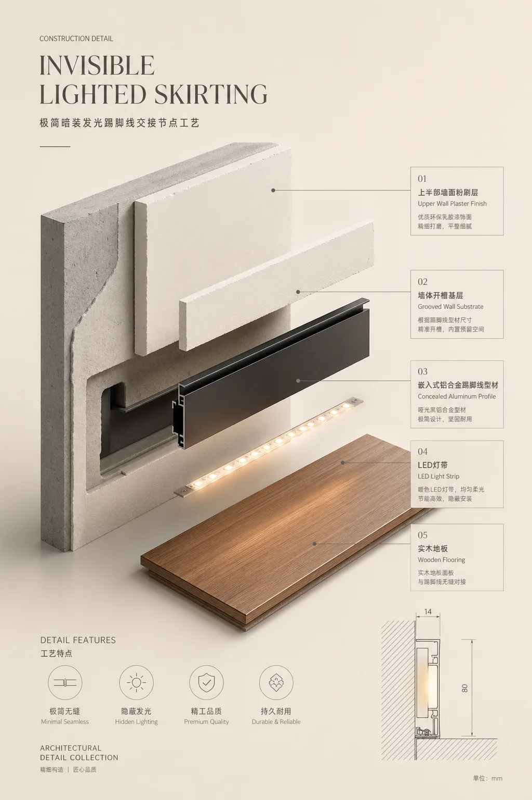

一张极具国际高级感与专业学术氛围的建筑施工工艺信息图表。采用3D等距视角的剖面分解图（爆炸图），精准展示极简暗装发光踢脚线的交接节点。画面中各构件悬浮剥离：开槽的墙体粉刷层基层、嵌入式的哑光黑铝合金踢脚线型材、散发着柔和光晕的暖色LED灯带、完美收口的上半部墙面粉刷层，以及底部无缝对接的温润实木地板面板。重点排版风格： 采用顶级建筑设计杂志内页的排版美学，大面积极其克制的留白，排版精美、内敛且极具呼吸感。采用低饱和度的静奢风配色，背景为柔和的暖砂色。各个结构层旁延伸出极简的深灰色引出线，对齐连接着优雅的文字标注说明框。图文排版严谨且充满几何美学，呈现出博物馆级工业展板的高级感。金属边缘带有细腻的高光反射，光影极其干净，8K超高清渲染。

---

## 49 · 卫生间防水施工工艺

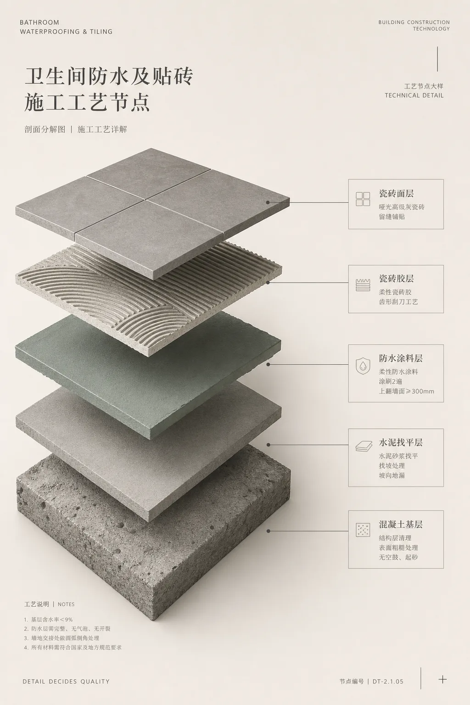

一张极具国际高级感与专业学术氛围的建筑施工工艺信息图表。采用3D等距视角的剖面分解图（爆炸图），精准展示卫生间防水及贴砖的施工节点大样。画面从下至上依次悬浮展开：底层粗糙的混凝土基层、水泥找平层、低饱和度灰绿色的柔性防水涂料层、带有立体梳齿纹理的瓷砖胶层，以及顶层的哑光高级灰瓷砖面层。重点排版风格： 采用顶级建筑设计杂志内页的排版美学，大面积极其克制的留白，排版精美、内敛且极具呼吸感。整体为低饱和度的静奢风配色，背景为极具高级感的浅燕麦色。各个结构层旁延伸出极简的深灰色引出线，连接着优雅的文字标注说明框。图文完美融合，呈现出博物馆级建筑展板的极致高级感。全局采用柔和的漫反射光照，材质纹理极具触感，8K超高清渲染。

---

## 50 · 轻钢龙骨石膏板吊顶工艺

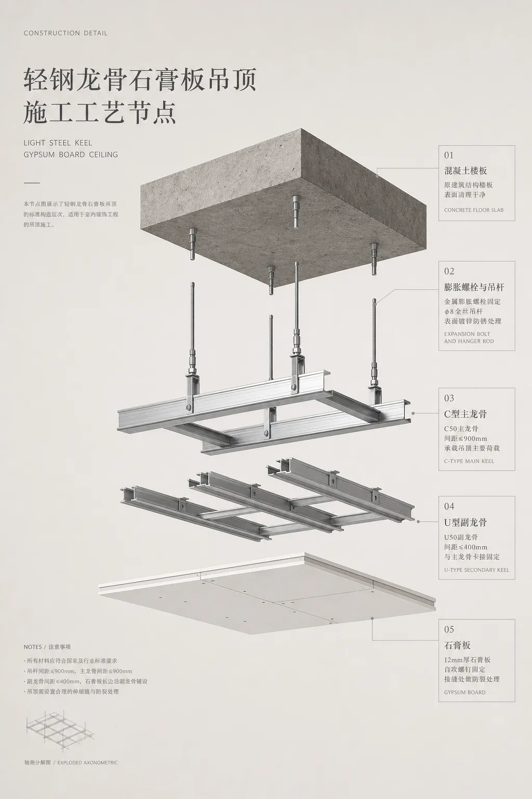

一张极具高级感和专业性的建筑施工工艺信息图表。采用3D等距视角的剖面分解图（爆炸图），展示轻钢龙骨石膏板吊顶的施工节点大样。 从上到下清晰地悬浮展示各个结构层：顶部的混凝土楼板底面、金属膨胀螺栓与垂直的吊杆、C型主龙骨、U型副龙骨，以及最底层的石膏板。 配色与排版： 采用极度克制的低饱和度静奢风（Quiet Luxury）配色。背景为柔和的高级灰或浅燕麦色。材质呈现逼真的物理质感：拉丝银灰色的轻钢龙骨、纯白色的哑光石膏板、粗糙的灰色混凝土。 图文排版设计： 画面图文并茂，具有杂志内页般的精美内敛排版。在每个悬浮的结构层旁边，有极细的深灰色引出线，连接着极简的文字标注框。留白充足，充满国际学术画廊的质感。极致柔和的漫反射光影，8k超高清建筑级渲染比例

---
